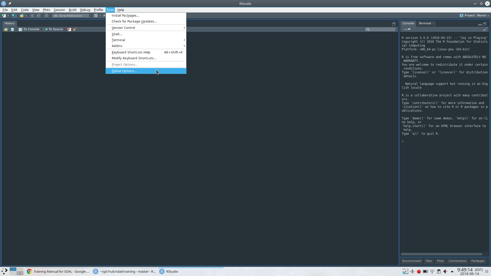
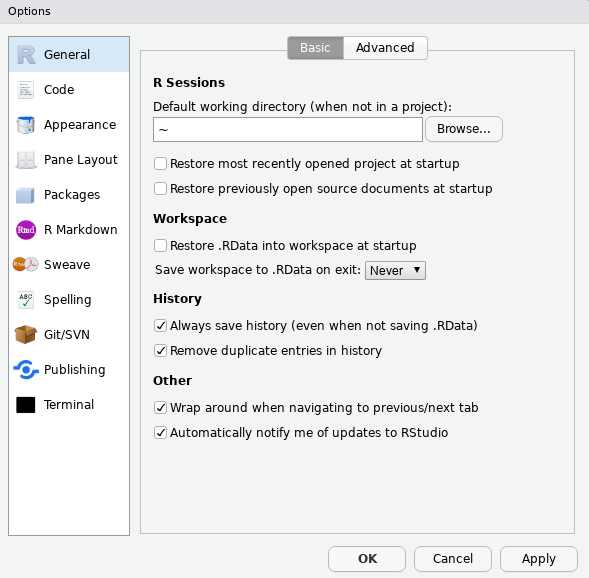

# Setup {-}

In general, the only thing you really need to work on our servers is a browser.
However, having a terminal application (e.g., Bash Shell) is really useful.

The setup instructions are taken and adapted from the [Software-Carpenty Workshop Template](http://swcarpentry.github.io/workshop-template/)

## The Bash Shell {-}
Bash is a commonly-used shell that gives you the power to do simple tasks more quickly.

### Windows {-}
[Video Tutorial](https://www.youtube.com/watch?v=339AEqk9c-8)

1.  Download the Git for Windows installer: [https://git-for-windows.github.io/](https://git-for-windows.github.io/).
2.  Run the installer and follow the steps bellow:
    1.  Click on "Next".
    2.  Click on "Next".
    3.  **Keep "Use Git from the Windows Command Prompt" selected and click on "Next".**
        If you forgot to do this programs that you need for the workshop will not work properly.
        If this happens rerun the installer and select the appropriate option.
    4.  Click on "Next".
    5.  Keep "Checkout Windows-style, commit Unix-style line endings" selected and click on "Next".
    6.  **Keep "Use Windows' default console window" selected and click on "Next".**
    7.  Click on "Install".
    8.  Click on "Finish".
3.  If your "HOME" environment variable is not set (or you don't know what this is):
    1. Open command prompt (Open Start Menu then type cmd and press [Enter])
    2.  Type the following line into the command prompt window exactly as shown: `setx HOME "%USERPROFILE%"`
    3.  Press [Enter], you should see `SUCCESS: Specified value was saved.`
    4.  Quit command prompt by typing exit then pressing [Enter]

This will provide you with both Git and Bash in the Git Bash program.

### macOS {-}

The default shell in all versions of macOS is Bash, so no need to install anything. You access Bash from the Terminal (found in /Applications/Utilities). See the Git installation video tutorial for an example on how to open the Terminal. You may want to keep Terminal in your dock for this workshop.

### Linux {-}

The default shell is usually Bash, but if your machine is set up differently you can run it by opening a terminal and typing bash. There is no need to install anything.


## Git {-}

Git is a version control system that lets you track who made changes to what when and has options for easily updating a shared or public version of your code on github.com. You will need a supported web browser (current versions of Chrome, Firefox or Safari, or Internet Explorer version 9 or above).

You will need an account at github.com for parts of the Git lesson. Basic GitHub accounts are free. We encourage you to create a GitHub account if you don't have one already. Please consider what personal information you'd like to reveal. For example, you may want to review these instructions for keeping your email address private provided at GitHub.

### Windows {-}
Git should be installed on your computer as part of your Bash install (described above).

### macOS {-}
Video Tutorial
For OS X 10.9 and higher, install Git for Mac by downloading and running the most recent "mavericks" installer from this list. After installing Git, there will not be anything in your /Applications folder, as Git is a command line program. For older versions of OS X (10.5-10.8) use the most recent available installer labelled "snow-leopard" available here.

### Linux {-}
If Git is not already available on your machine you can try to install it via your distro's package manager. For Debian/Ubuntu run sudo apt-get install git and for Fedora run sudo dnf install git.

## Text Editor {-}
When you're writing code, it's nice to have a text editor that is optimized for writing code, with features like automatic color-coding of key words. The default text editor on macOS and Linux is usually set to Vim, which is not famous for being intuitive. If you accidentally find yourself stuck in it, try typing the escape key, followed by :q! (colon, lower-case 'q', exclamation mark), then hitting Return to return to the shell.

- Atom: https://flight-manual.atom.io/getting-started/sections/installing-atom/
- Sublime Text: https://www.sublimetext.com/3
- Emacs
- VIM

### Windows {-}
Video Tutorial
nano is a basic editor and the default that instructors use in the workshop. To install it, download the Windows installer and double click on the file to run it. This installer requires an active internet connection.

Others editors that you can use are Notepad++ or Sublime Text. Be aware that you must add its installation directory to your system path. Please ask your instructor to help you do this.

### macOS {-}
nano is a basic editor and the default that instructors use in the workshop. See the Git installation video tutorial for an example on how to open nano. It should be pre-installed.

Others editors that you can use are Text Wrangler or Sublime Text.

### Linux {-}
nano is a basic editor and the default that instructors use in the workshop. It should be pre-installed.

Others editors that you can use are Gedit, Kate or Sublime Text.

## R {-}
R is a programming language that is especially powerful for data exploration, visualization, and statistical analysis. To interact with R, we use RStudio.

RStudio IDE: https://www.rstudio.com/products/rstudio/download/preview/


### Windows {-}
Video Tutorial
Install R by downloading and running this .exe file from CRAN. Also, please install the RStudio IDE. Note that if you have separate user and admin accounts, you should run the installers as administrator (right-click on .exe file and select "Run as administrator" instead of double-clicking). Otherwise problems may occur later, for example when installing R packages.

### macOS {-}
Video Tutorial
Install R by downloading and running this .pkg file from CRAN. Also, please install the RStudio IDE.

### Linux {-}
You can download the binary files for your distribution from CRAN. Or you can use your package manager (e.g. for Debian/Ubuntu run sudo apt-get install r-base and for Fedora run sudo dnf install R). Also, please install the RStudio IDE.

### Post installation settings {-}

**Open up global options**

You can do this by going to `Tools > Global Options` on the top menu bar.
<!-- -->

**Setup startup defaults**

Make sure:

- "Restore .RData into workspace at startup" box is unchecked
- "Save workspace to .RData on exit" is set to "Never"

It's also advised to uncheck the top two options as well:

- Restore most recently opened project at startup
- Restore previously open source documents at startup

<!-- -->

## SQLite {-}
SQL is a specialized programming language used with databases. We use a simple database manager called SQLite in our lessons.

### Windows {-}
The [Windows Installer](https://github.com/swcarpentry/windows-installer/releases/download/v0.3/SWCarpentryInstaller.exe) installs SQLite for Windows. If you used the installer to configure nano, you don't need to run it again.

### macOS {-}
SQLite comes pre-installed on macOS.

### Linux {-}
SQLite comes pre-installed on Linux.

## SSH Keys {-}

Typically we'll be going over this step together as a class.
As long as you have Bash installed you'll be okay.

It'll be a good idea to first check and see if you already have any SSH keys: https://help.github.com/articles/checking-for-existing-ssh-keys/

GitHub has a set of instructions on how to create SSH keys: https://help.github.com/articles/generating-a-new-ssh-key-and-adding-it-to-the-ssh-agent/#generating-a-new-ssh-key

The below is an adapted form of the GiHub instructions

1. Open Terminal.
2. run `ssh-keygen`, this creates a new ssh key
```
Generating public/private rsa key pair.
```
3. When you're prompted to "Enter a file in which to save the key," press Enter. This accepts the default file location.
```
Enter a file in which to save the key (/home/you/.ssh/id_rsa): [Press enter]
```
4. At the prompt, when it asks for a password, just leave it blank and [Press enter].
Otherwise, for more information, see "Working with SSH key passphrases".
```
Enter passphrase (empty for no passphrase): [Type a passphrase]
Enter same passphrase again: [Type passphrase again]
```
5. If you look at the contents of `~/.ssh`, you should see the `id_rsa` and `id_rsa.pub` files.
```bash
$ ls ~/.ssh
id_rsa  id_rsa.pub
```
6. Copy the **public** key (`is_rsa.pub`)
```
$ cat ~/.ssh/id_rsa.pub
```
This is the public key you will use to paste into the system that asks for an SSH key

Other resources:

- https://www.rosehosting.com/blog/ssh-login-without-password-using-ssh-keys/

### GitHub {-}

Once you have your ssh key copied, you can add the key to your GitHub account by following the GitHub instructions:

https://help.github.com/articles/adding-a-new-ssh-key-to-your-github-account/

### Lightfoot {-}

If you have an SSH key on your laptop, you can use it so you don't have to type your password when logging into lightfoot

1. run `ssh-copy-id`

```bash
$ ssh-copy-id YOUR_PID@lightfoot.vbi.vt.edu
```

It will prompt you for your password, and if it's your first time connecting to the server also ask you to confirm the connection by typing `yes`

Once you ran `ssh-copy-id`, you can connect directly to lightfoot

```bash
$ ssh YOUR_PID@lightfoot.vbi.vt.edu
```

### GitLab (devlab) {-}

The process of adding a key to GitLab is similar to the GitHub instuctions: https://docs.gitlab.com/ee/gitlab-basics/create-your-ssh-keys.html

## LaTeX {-}

Please go to https://www.latex-project.org/get/ to find the LaTeX distribution for your operating system.
If you can, you should try to install the "full" version of TeX, but it is a very large install.
The upside of installing everything is usually you'll never have a problem in the future with loading TeX or LaTeX packages.

There's also a very good LaTeX IDE called TeXstudio: https://www.texstudio.org/.
It's a fork of Texmaker (http://www.xm1math.net/texmaker/),
but I find that TeXstudio has better autocompletes.
You can try both of them, they're pretty much the same (in both function and visuals)
