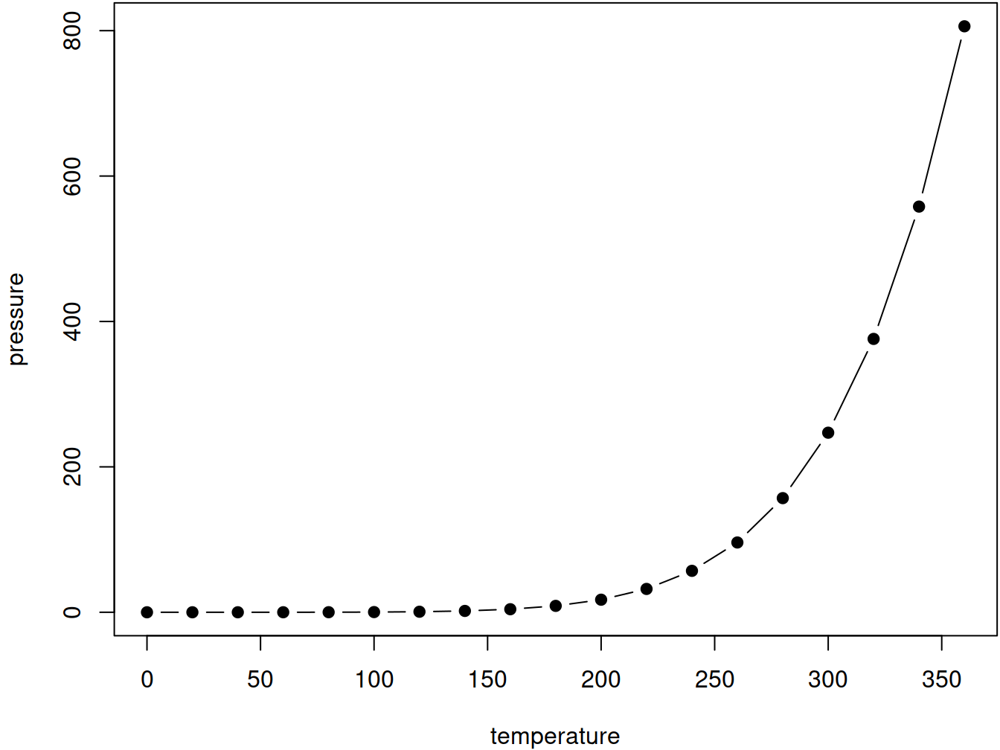

# Syllabus {-}

<!--
You can label chapter and section titles using `{#label}` after them, e.g., we can reference Chapter \@ref(intro). If you do not manually label them, there will be automatic labels anyway, e.g., Chapter 

Figures and tables with captions will be placed in `figure` and `table` environments, respectively.


```r
par(mar = c(4, 4, .1, .1))
plot(pressure, type = 'b', pch = 19)
```

<div class="figure" style="text-align: center">

<p class="caption">(\#fig:nice-fig)Here is a nice figure!</p>
</div>

Reference a figure by its code chunk label with the `fig:` prefix, e.g., see Figure \@ref(fig:nice-fig). Similarly, you can reference tables generated from `knitr::kable()`, e.g., see Table \@ref(tab:nice-tab).


```r
knitr::kable(
  head(iris, 20), caption = 'Here is a nice table!',
  booktabs = TRUE
)
```


Table: (\#tab:nice-tab)Here is a nice table!

 Sepal.Length   Sepal.Width   Petal.Length   Petal.Width  Species 
-------------  ------------  -------------  ------------  --------
          5.1           3.5            1.4           0.2  setosa  
          4.9           3.0            1.4           0.2  setosa  
          4.7           3.2            1.3           0.2  setosa  
          4.6           3.1            1.5           0.2  setosa  
          5.0           3.6            1.4           0.2  setosa  
          5.4           3.9            1.7           0.4  setosa  
          4.6           3.4            1.4           0.3  setosa  
          5.0           3.4            1.5           0.2  setosa  
          4.4           2.9            1.4           0.2  setosa  
          4.9           3.1            1.5           0.1  setosa  
          5.4           3.7            1.5           0.2  setosa  
          4.8           3.4            1.6           0.2  setosa  
          4.8           3.0            1.4           0.1  setosa  
          4.3           3.0            1.1           0.1  setosa  
          5.8           4.0            1.2           0.2  setosa  
          5.7           4.4            1.5           0.4  setosa  
          5.4           3.9            1.3           0.4  setosa  
          5.1           3.5            1.4           0.3  setosa  
          5.7           3.8            1.7           0.3  setosa  
          5.1           3.8            1.5           0.3  setosa  

You can write citations, too. For example, we are using the **bookdown** package [@R-bookdown] in this sample book, which was built on top of R Markdown and **knitr** [@xie2015].


Here you will find the schedule and the topics that will be covered in each lesson.


## Schedule

### May {-}

| Monday 	| Tuesday 	| Wednesday 	| Thursday 	| Friday 	| Saturday 	| Sunday 	|
|--------	|---------	|-----------	|----------	|--------	|----------	|--------	|
|        	|         	|           	|          	|        	|          	|        	|
|        	|         	|           	|          	|        	|          	|        	|
|        	|         	|           	|          	|        	|          	|        	|
| 21     	| 22      	| 23        	| 24       	| 25     	| 26       	| 27     	|
| 28     	| 29      	| 30        	| 31       	|        	|          	|        	|


### June {-}

| Monday 	| Tuesday 	| Wednesday 	| Thursday 	| Friday 	| Saturday 	| Sunday 	|
|--------	|---------	|-----------	|----------	|--------	|----------	|--------	|
|        	|         	|           	|          	| 1      	| 2        	| 3      	|
| 4      	| 5       	| 6         	| 7        	| 8      	| 9        	| 10     	|
| 11     	| 12      	| 13        	| 14       	| 15     	| 16       	| 17     	|
| 18     	| 19      	| 20        	| 21       	| 22     	| 23       	| 24     	|
| 25     	| 26      	| 27        	| 28       	| 29     	| 30       	|        	|

### July {-}

### August {-}
-->

The bulk of the material comes from the [R for Data Science by Hadley Wickham and Garrett Grolemund](http://r4ds.had.co.nz/).
There are additional topics that come from [Software-Carpentry](https://software-carpentry.org/lessons/),
and various other materials found online.
Supplemental material comes from an appropriate [DataCamp](https://www.datacamp.com/) course.

Each chapter (and sometimes a set of chapters) can be taught within a 3 hour block with a break roughly every 45 minutes.

The total amount of material cover's roughly a months worth of material (3 Hours a day, 5 Days a week).

The introduction page for each chapter contains links to relevent chapters and additional resources.

## Lesson Breakdown {-}

### Lesson 1 {-}

Goals:

1. Get up and running in the lab
2. Know what bits of infrastructure we have
3. Introduction to R through visualization
4. How to load your own data into R

- Getting setup
  - Getting the shell
  - SSH keys
- The SDAL Infrastructure
  - RStudio
  - The other tools availiable
- Shell (Bash)
- The "Tidyverse" ecosystem
- Scripts and running R code
- Exploring your data through visualizations (`ggplot2`)
- Loading and saving a datasets (`readr`, `haven`)

### Lesson 2 {-}

Goals:

1. Introduction to Markdown (`rmarkdown`) and `knitr`
  - Take "pretty" notes with "simple" notation
  - Learn how to create basic reports with your code
2. What the code projects look like
3. Working with git locally

- Markdown
- Knitr
- The project template
  - Workflow basics
- Projects
- Git (locally)

### Lesson 3 {-}

Goals:

1. Git with an eye towards collaboration
2. Working with remotes (GitHub and GitLab)
3. Collaborating with branches

- Git (remotes)
- Git (branches)
- Git (collaboration)

### Lesson 4 {-}

Goals:

1. Start the process of manipulating data
2. Perform data subsetting and aggregations
3. Explore data with basic statistics and visualizations
4. Reshaping data and fixing common data problems through the tidying process

- Transform data with (`dplyr`)
- Pipes (`%>%`)
- Exploratory Data Analysis (EDA)
- `tibble`, the tidyverse "dataframe"
- Tidying data (`tidyr`)

### Lesson 5 {-}

Goals:

1. Understanding relational data
2. Merging datasets together
3. Work with relational data in a database
4. Writing SQL code and how to run them from within R

- Relational Data in R (`dplyr`)
- Working with databases
  - SQLite
  - PostgreSQL
- SQL
- Working with SQL in your R code

### Lesson 6 {-}
  
Goals:

1. Work with strings, factors, and date time values in R

- Strings
- Factors (`forcats`)
- Dates and Times


### Lesson 7 {-}

1. Programming "fundamentals"
  - Functions
  - Vectors
  - Loops

- Functions
- Vectors
- Iteration
  - `purrr`
  - for loops

### Lesson 8 {-}

Goals:

1. The dialects of R
2. Review of tidyverse functions
3. How tidyverse relates to base R
  - The base R data.frame object
  - apply family of functions
4. How data.table playes a role in the R ecosystem

- `base` R
- `data.table`
- `tidyverse`

### Lesson 9 {-}

- Working with geospatial data with `sf`

### Lesson 10 {-}

Goals:

1. Web scraping
  - API
  - Scrape

### Lesson 11 {-}

- Communication
  - R Markdown
  - Graphics
- R Markdown formats
- Shiny
