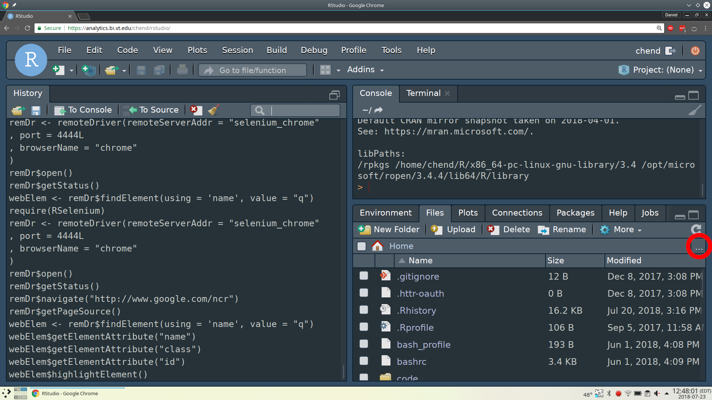
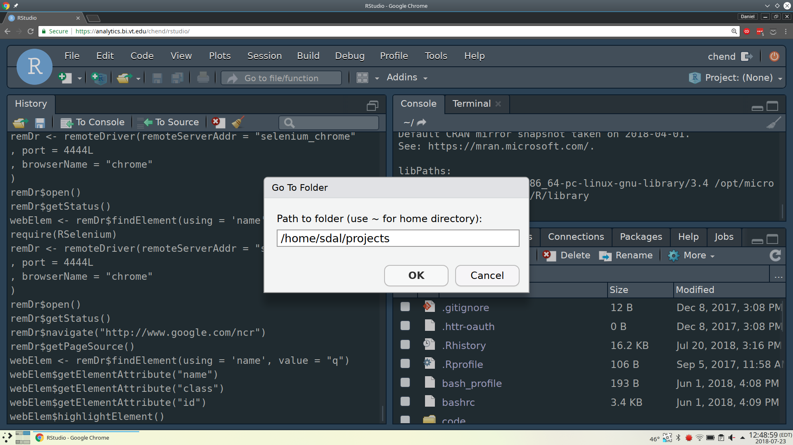

# RStudio

## Accessing folders

### Outside of Home

Sometimes you might want to naviate outside your home directory.
To do this first click the 3 dots in the files panel to manually input a directory.

(\#fig:unnamed-chunk-2)Go to a specific directory

Then you can manually navigate into a different path.

(\#fig:unnamed-chunk-3)Manually input directory

This example specifically shows navigating to the `/home/sdal/projects` directory.
However, you might want to check your project's `data` folder,
a link to the relevent data folder should already be in there.
