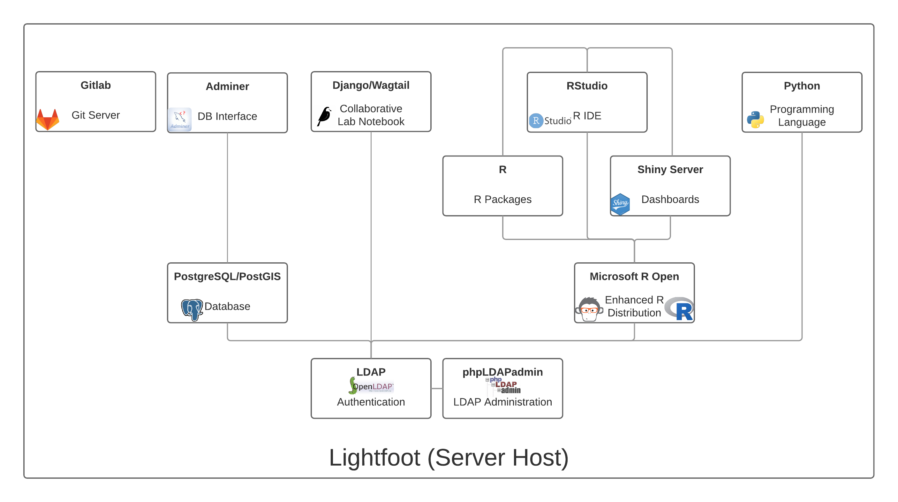

# Infrastructure

We have 2 servers in the lab, `lightfoot` and `snowmane` (named after horses from Lord of the Rings).
The main "production" server is `lightfoot` where all of our data and compute resources exist.

## Components

We use [Docker](https://www.docker.com/) in our lab.
This allows us to install various components without affecting the underlying server.
A brief history of how we settled on docker and why is in this blog post on [From VMs to LXC Containers to Docker Containers](https://chendaniely.github.io/sdal/2017/07/07/vm_lxc_docker/).

Figure \@ref(fig:docker-lightfoot) depicts what conatiners we have on `lightfoot`.
You can think of each 'container' as an 'application' just like one you are running on your laptop.
But the behvaior of each 'container' is more like a separate server you connect to.

(\#fig:docker-lightfoot)The Docker infrastructure used in SDAL

The primary conatiners you will be using are the RStudio, Adminer, and Django/Wagtail containers.
They all exist on `lightfoot` and can all be reached in a browser with [`https://analytics.bi.vt.edu`](https://analytics.bi.vt.edu) and an appropriate suffix (e.g., [`/rstudio`](https://analytics.bi.vt.edu/rstudio), [`/db`](https://analytics.bi.vt.edu/db)).

## Accessing Servers

