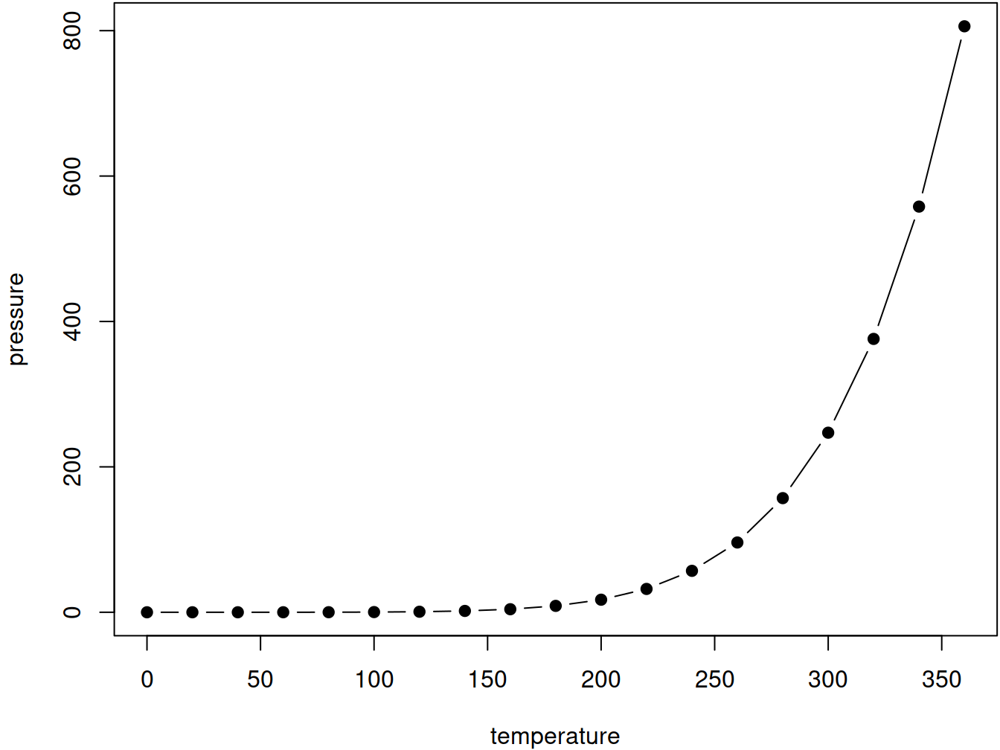

# Syllabus {#syllabus}

<!--
You can label chapter and section titles using `{#label}` after them, e.g., we can reference Chapter \@ref(intro). If you do not manually label them, there will be automatic labels anyway, e.g., Chapter 

Figures and tables with captions will be placed in `figure` and `table` environments, respectively.


```r
par(mar = c(4, 4, .1, .1))
plot(pressure, type = 'b', pch = 19)
```

<div class="figure" style="text-align: center">

<p class="caption">(\#fig:nice-fig)Here is a nice figure!</p>
</div>

Reference a figure by its code chunk label with the `fig:` prefix, e.g., see Figure \@ref(fig:nice-fig). Similarly, you can reference tables generated from `knitr::kable()`, e.g., see Table \@ref(tab:nice-tab).


```r
knitr::kable(
  head(iris, 20), caption = 'Here is a nice table!',
  booktabs = TRUE
)
```


Table: (\#tab:nice-tab)Here is a nice table!

 Sepal.Length   Sepal.Width   Petal.Length   Petal.Width  Species 
-------------  ------------  -------------  ------------  --------
          5.1           3.5            1.4           0.2  setosa  
          4.9           3.0            1.4           0.2  setosa  
          4.7           3.2            1.3           0.2  setosa  
          4.6           3.1            1.5           0.2  setosa  
          5.0           3.6            1.4           0.2  setosa  
          5.4           3.9            1.7           0.4  setosa  
          4.6           3.4            1.4           0.3  setosa  
          5.0           3.4            1.5           0.2  setosa  
          4.4           2.9            1.4           0.2  setosa  
          4.9           3.1            1.5           0.1  setosa  
          5.4           3.7            1.5           0.2  setosa  
          4.8           3.4            1.6           0.2  setosa  
          4.8           3.0            1.4           0.1  setosa  
          4.3           3.0            1.1           0.1  setosa  
          5.8           4.0            1.2           0.2  setosa  
          5.7           4.4            1.5           0.4  setosa  
          5.4           3.9            1.3           0.4  setosa  
          5.1           3.5            1.4           0.3  setosa  
          5.7           3.8            1.7           0.3  setosa  
          5.1           3.8            1.5           0.3  setosa  

You can write citations, too. For example, we are using the **bookdown** package [@R-bookdown] in this sample book, which was built on top of R Markdown and **knitr** [@xie2015].
-->

Here you will find the schedule and the topics that will be covered in each lesson.


## Schedule

### May {-}

| Monday 	| Tuesday 	| Wednesday 	| Thursday 	| Friday 	| Saturday 	| Sunday 	|
|--------	|---------	|-----------	|----------	|--------	|----------	|--------	|
|        	|         	|           	|          	|        	|          	|        	|
|        	|         	|           	|          	|        	|          	|        	|
|        	|         	|           	|          	|        	|          	|        	|
| 21     	| 22      	| 23        	| 24       	| 25     	| 26       	| 27     	|
| 28     	| 29      	| 30        	| 31       	|        	|          	|        	|


### June {-}

| Monday 	| Tuesday 	| Wednesday 	| Thursday 	| Friday 	| Saturday 	| Sunday 	|
|--------	|---------	|-----------	|----------	|--------	|----------	|--------	|
|        	|         	|           	|          	| 1      	| 2        	| 3      	|
| 4      	| 5       	| 6         	| 7        	| 8      	| 9        	| 10     	|
| 11     	| 12      	| 13        	| 14       	| 15     	| 16       	| 17     	|
| 18     	| 19      	| 20        	| 21       	| 22     	| 23       	| 24     	|
| 25     	| 26      	| 27        	| 28       	| 29     	| 30       	|        	|

### July {-}

### August {-}

## Lesson Breakdown

### Lesson 1

- Getting setup
  - Getting the shell
  - SSH keys
- The SDAL Infrastructure
  - RStudio
  - The other tools availiable
- Shell (Bash)
- The "Tidyverse"
- Exploring your data through visualizations (ggplot2)
- Loading a dataset (readr)

### Lesson 2

- Markdown
- Knitr
- The project template
- Projects
- Git (locally)

### Lesson 3

- Git (remotes)
- Git (branches)
- Git (collaboration)

### Lesson 4

- Workflow Basics
- Transformations
- Scripts

### Lesson 5

- EDA
- Tibbles
- Tidy

### Lesson 6

- Relational Data
- SQL

### Lesson 7

- Strings
- Factors
- Dates and Times

### Lesson 8

- Pipes
- Functions
- Vectors
- Iteration

### Lesson 9

- Communication
  - R Markdown
  - Graphics
- R Markdown formats
- Shiny

### Lesson 10
