# (PART) R {-}

# Data Visualization

Data visualization Chapter in r4ds

- http://r4ds.had.co.nz/data-visualisation.html

Datacamp Courses:

- The `ggplot2` stack
    - https://www.datacamp.com/courses/data-visualization-with-ggplot2-1
    - https://www.datacamp.com/courses/data-visualization-with-ggplot2-2
    - https://www.datacamp.com/courses/data-visualization-with-ggplot2-part-3

## Loading ggplot2


```r
library(ggplot2)
```


```r
# mpg dataset from the ggplot2 library
mpg
```

```
## # A tibble: 234 x 11
##    manufacturer model    displ  year   cyl trans   drv     cty   hwy fl   
##    <chr>        <chr>    <dbl> <int> <int> <chr>   <chr> <int> <int> <chr>
##  1 audi         a4         1.8  1999     4 auto(l… f        18    29 p    
##  2 audi         a4         1.8  1999     4 manual… f        21    29 p    
##  3 audi         a4         2    2008     4 manual… f        20    31 p    
##  4 audi         a4         2    2008     4 auto(a… f        21    30 p    
##  5 audi         a4         2.8  1999     6 auto(l… f        16    26 p    
##  6 audi         a4         2.8  1999     6 manual… f        18    26 p    
##  7 audi         a4         3.1  2008     6 auto(a… f        18    27 p    
##  8 audi         a4 quat…   1.8  1999     4 manual… 4        18    26 p    
##  9 audi         a4 quat…   1.8  1999     4 auto(l… 4        16    25 p    
## 10 audi         a4 quat…   2    2008     4 manual… 4        20    28 p    
## # ... with 224 more rows, and 1 more variable: class <chr>
```


## Creating a ggplot


```r
ggplot(data = mpg) + geom_point(mapping = aes(x = displ, y = hwy))
```


## Aesthetic Mapings


```r
# using color
ggplot(data = mpg) + geom_point(mapping = aes(x = displ, y = hwy, color = class))
```


```r
# using size
ggplot(data = mpg) + geom_point(mapping = aes(x = displ, y = hwy, size = class))
```

```
## Warning: Using size for a discrete variable is not advised.
```

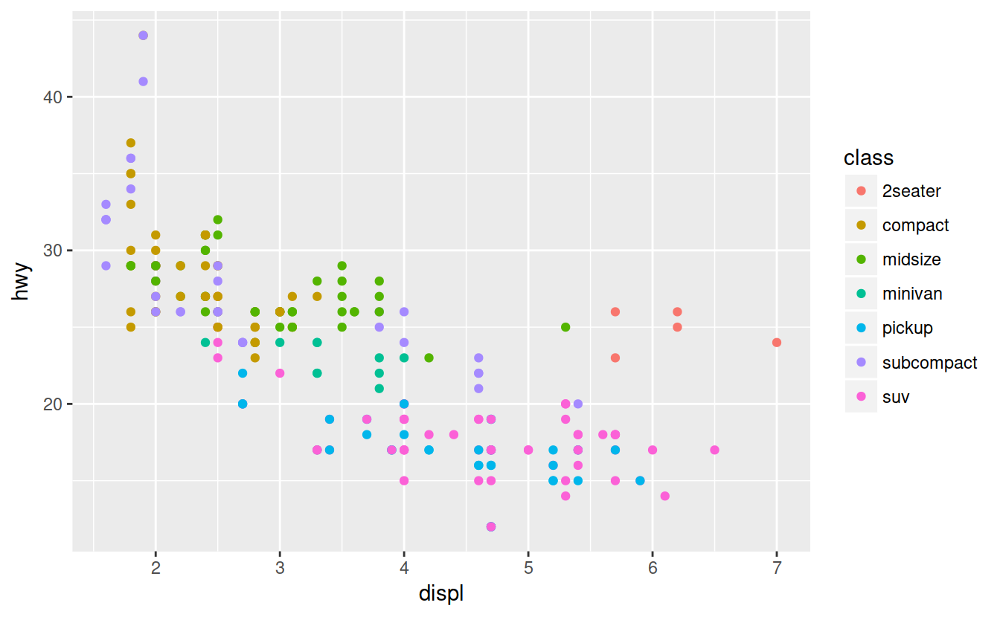


```r
# using alpha
ggplot(data = mpg) + geom_point(mapping = aes(x = displ, y = hwy, alpha = class))
```


```r
# using shape
ggplot(data = mpg) + geom_point(mapping = aes(x = displ, y = hwy, shape = class))
```

```
## Warning: The shape palette can deal with a maximum of 6 discrete values
## because more than 6 becomes difficult to discriminate; you have 7.
## Consider specifying shapes manually if you must have them.
```

```
## Warning: Removed 62 rows containing missing values (geom_point).
```

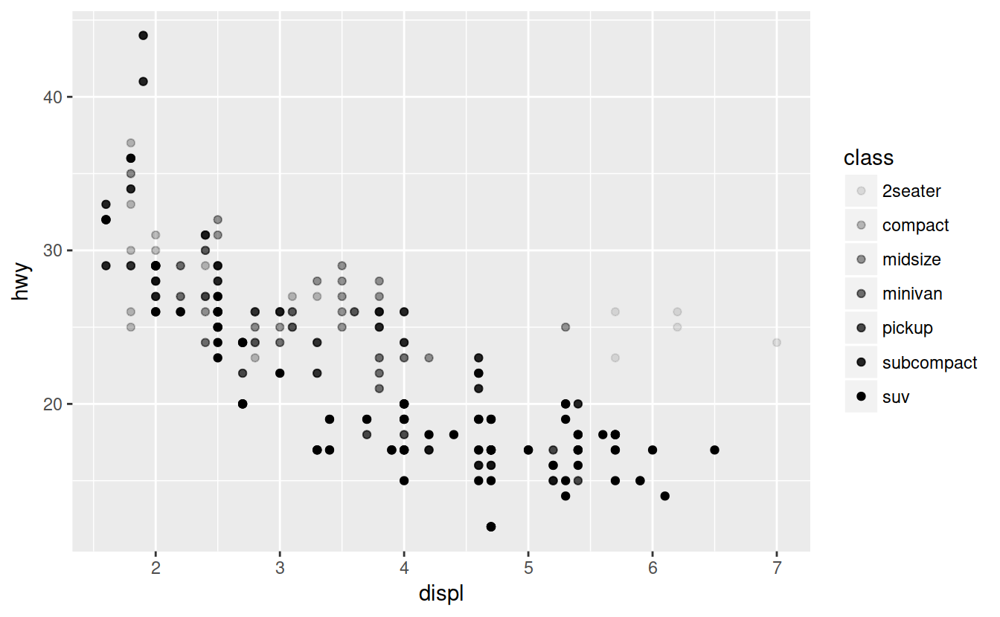


```r
# manual set property
# note color is not in the aes
ggplot(data = mpg) + geom_point(mapping = aes(x = displ, y = hwy), color = "blue")
```

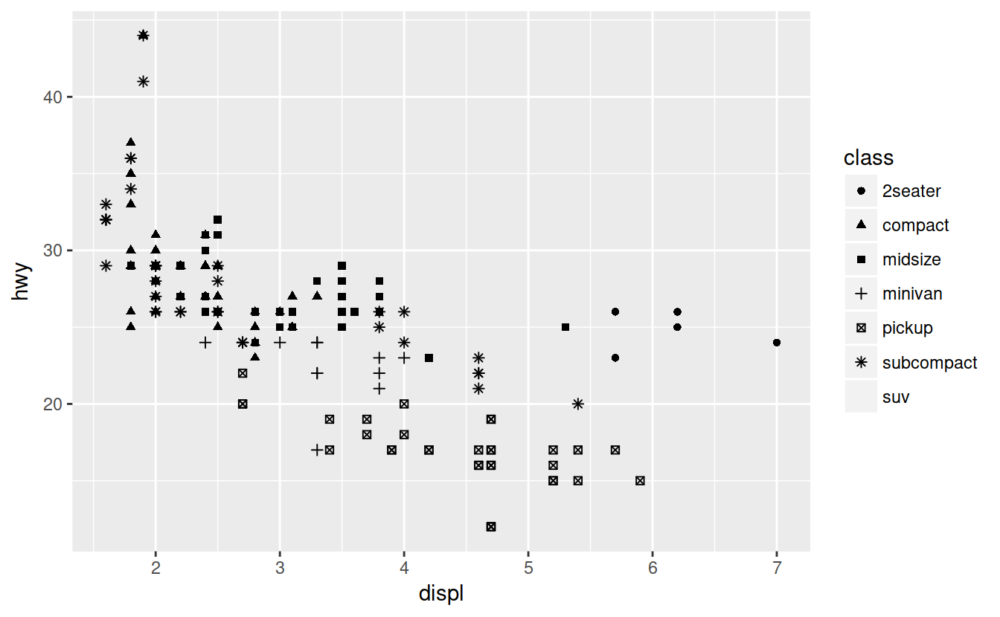


```r
# if you put a variable outside you will get an error
ggplot(data = mpg) + geom_point(mapping = aes(x = displ, y = hwy), color = class)
```

## Facets


```r
ggplot(data = mpg) + geom_point(mapping = aes(x = displ, y = hwy)) + facet_wrap(~ class, nrow = 2)
```


```r
ggplot(data = mpg) + geom_point(mapping = aes(x = displ, y = hwy)) + facet_grid(drv ~ cyl)
```

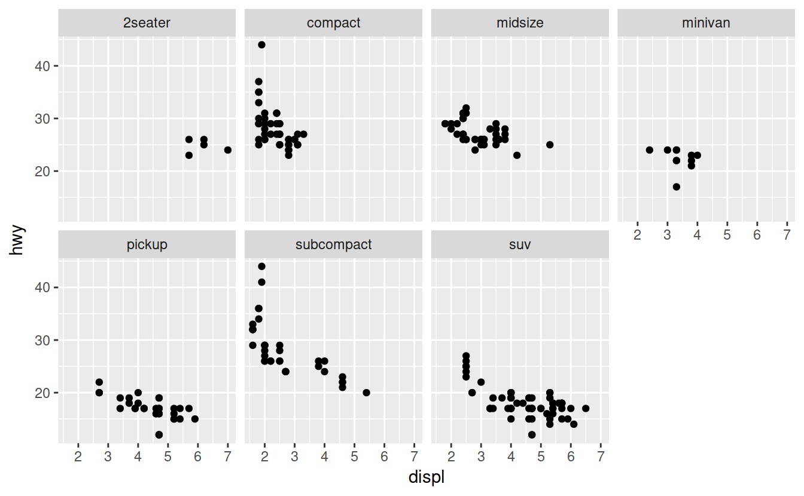

## Geometic Objects


```r
ggplot(data = mpg) + geom_point(mapping = aes(x = displ, y = hwy))
```


```r
ggplot(data = mpg) + geom_smooth(mapping = aes(x = displ, y = hwy))
```

```
## `geom_smooth()` using method = 'loess'
```


```r
ggplot(data = mpg) + geom_smooth(mapping = aes(x = displ, y = hwy, linetime = drv))
```

```
## Warning: Ignoring unknown aesthetics: linetime
```

```
## `geom_smooth()` using method = 'loess'
```


```r
# base plot before groupings
ggplot(data = mpg) + geom_smooth(mapping = aes(x = displ, y = hwy))
```

```
## `geom_smooth()` using method = 'loess'
```

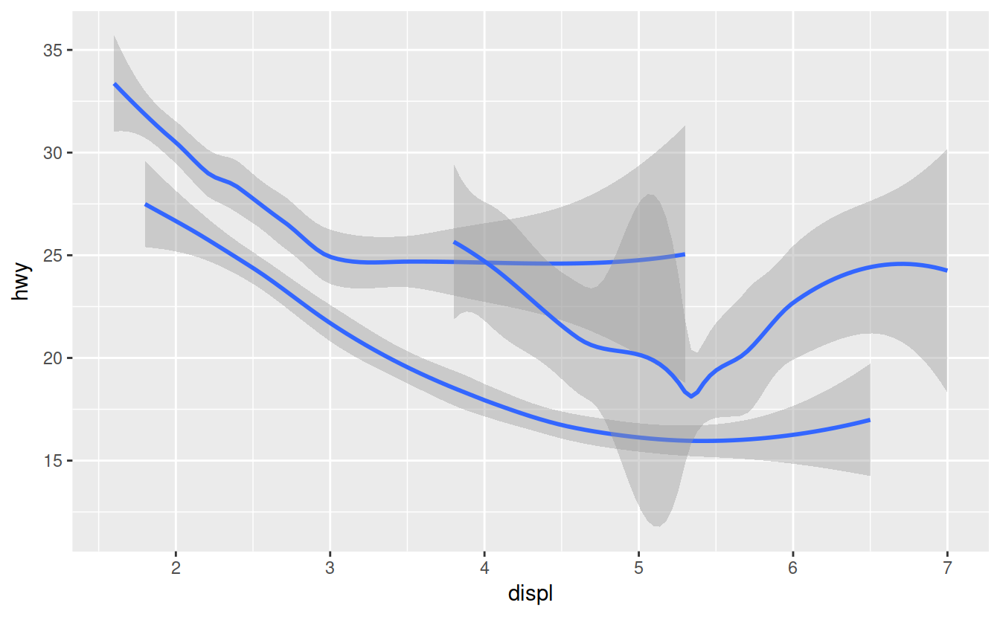


```r
# base plot before groupings
ggplot(data = mpg) + geom_smooth(mapping = aes(x = displ, y = hwy))
```

```
## `geom_smooth()` using method = 'loess'
```

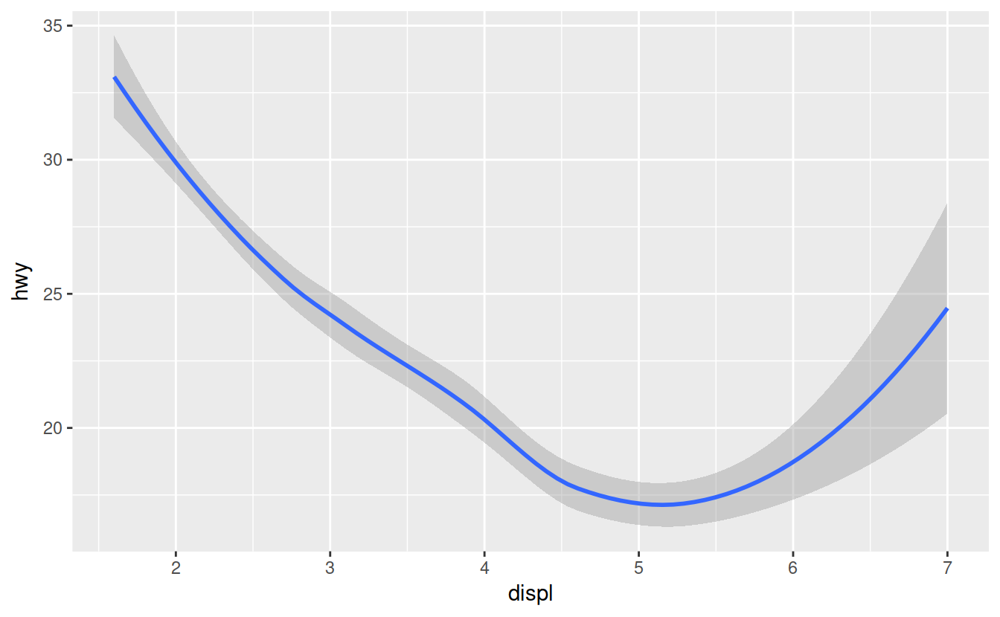

```r
# separate smoothing line by group
ggplot(data = mpg) + geom_smooth(mapping = aes(x = displ, y = hwy, group = drv))
```

```
## `geom_smooth()` using method = 'loess'
```


```r
# different color foe each group
ggplot(data = mpg) + geom_smooth(mapping = aes(x = displ, y = hwy, color = drv), show.legend = FALSE)
```

```
## `geom_smooth()` using method = 'loess'
```


Adding multiple geoms in the same plot

```r
ggplot(data = mpg) +
  geom_point(mapping = aes(x = displ, y = hwy)) +
  geom_smooth(mapping = aes(x = displ, y = hwy))
```

```
## `geom_smooth()` using method = 'loess'
```


The layering system will carry over values from the previous layer.
the ggplot layer will specify the global values


```r
ggplot(data = mpg, mapping = aes(x = displ, y = hwy)) +
  geom_point() +
  geom_smooth()
```

```
## `geom_smooth()` using method = 'loess'
```


Mappings in a a geom function, will overwrite the global settings (i.e., they are local settings)


```r
ggplot(data = mpg, mapping = aes(x = displ, y = hwy)) +
  geom_point(mapping = aes(color = class)) +
  geom_smooth()
```

```
## `geom_smooth()` using method = 'loess'
```


```r
ggplot(data = mpg, mapping = aes(x = displ, y = hwy)) +
  geom_point(mapping = aes(color = class)) +
  geom_smooth(
    data = dplyr::filter(mpg, class == 'subcompact'),
    se = FALSE
  )
```

```
## `geom_smooth()` using method = 'loess'
```

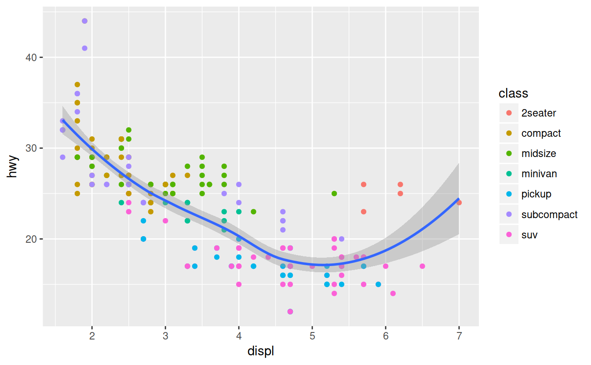

## Statistical Transformations


```r
dim(diamonds)
```

```
## [1] 53940    10
```


```r
head(diamonds)
```

```
## # A tibble: 6 x 10
##   carat cut       color clarity depth table price     x     y     z
##   <dbl> <ord>     <ord> <ord>   <dbl> <dbl> <int> <dbl> <dbl> <dbl>
## 1 0.23  Ideal     E     SI2      61.5    55   326  3.95  3.98  2.43
## 2 0.21  Premium   E     SI1      59.8    61   326  3.89  3.84  2.31
## 3 0.23  Good      E     VS1      56.9    65   327  4.05  4.07  2.31
## 4 0.290 Premium   I     VS2      62.4    58   334  4.2   4.23  2.63
## 5 0.31  Good      J     SI2      63.3    58   335  4.34  4.35  2.75
## 6 0.24  Very Good J     VVS2     62.8    57   336  3.94  3.96  2.48
```


```r
ggplot(data = diamonds) + geom_bar(mapping = aes(x = cut))
```


Use a *stat* to calculate a new value.
diamonds data gets "transformed" into a frequency table that get's plotted by the bar plot.

Look at the geom_bar documentation, you will see the `stat` will be `count` (i.e., `stat_count()`).


```r
ggplot(data = diamonds) + stat_count(mapping = aes(x = cut))
```


You can set stat to 'identity' if you have already calculated a frequency table


```r
pre_counted <- tibble::as.tibble(table(diamonds$cut))
```


```r
ggplot(data = pre_counted) +
  geom_bar(
    mapping = aes(x = Var1, y = n), stat = 'identity'
  )
```


```r
# overwrite default stat
# proportion instead of count
ggplot(data = diamonds) +
  geom_bar(
    mapping = aes(x = cut, y = ..prop.., group = 1)
  )
```


grouping: http://ggplot2.tidyverse.org/reference/aes_group_order.html

By default, the group is set to the interaction of all discrete variables in the
plot. This often partitions the data correctly, but when it does not, or when
no discrete variable is used in the plot, you will need to explicitly define the
grouping structure, by mapping group to a variable that has a different value
for each group.

## Position Adjustments


```r
# using color
ggplot(data = diamonds) + geom_bar(mapping = aes(x = cut, color = cut))
```


```r
# using fill
ggplot(data = diamonds) + geom_bar(mapping = aes(x = cut, fill = cut))
```


```r
# another example of fill
# fill a different variable than x
# This creates a stacked bar chart
ggplot(data = diamonds) + geom_bar(mapping = aes(x = cut, fill = clarity))
```

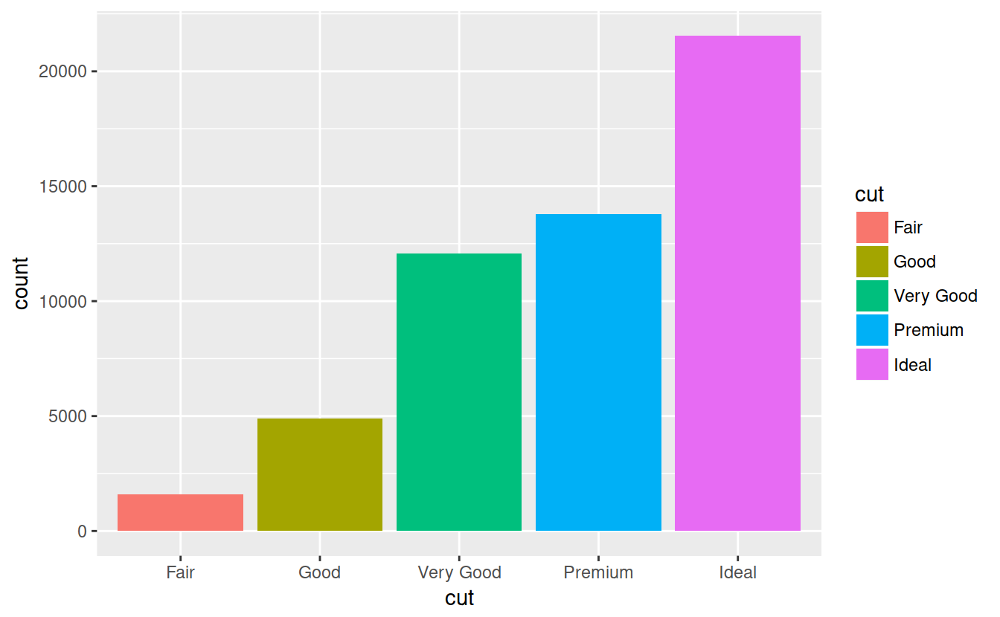

position: identity


```r
ggplot(data = diamonds, mapping = aes(x = cut, fill = clarity)) + geom_bar(alpha = 1/5, position = 'identity')
```

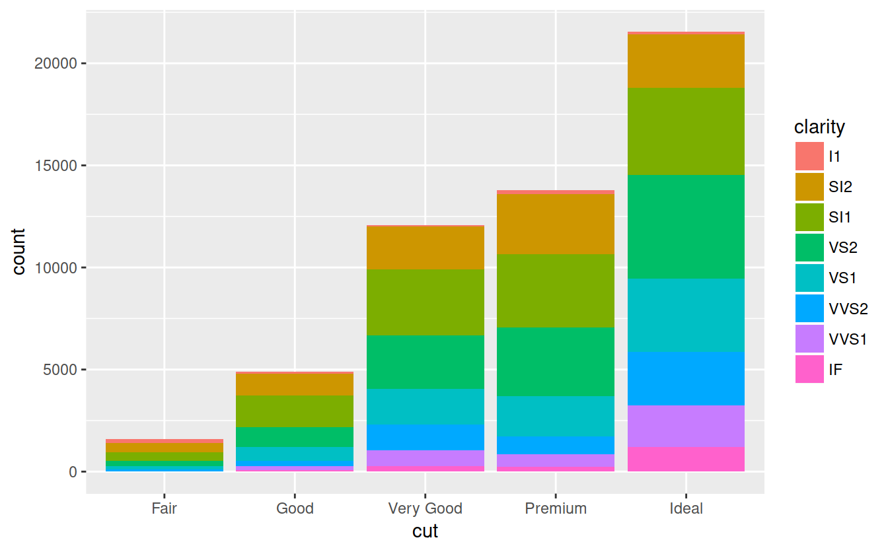


```r
ggplot(data = diamonds, mapping = aes(x = cut, color = clarity)) + geom_bar(fill = NA, position = 'identity')
```

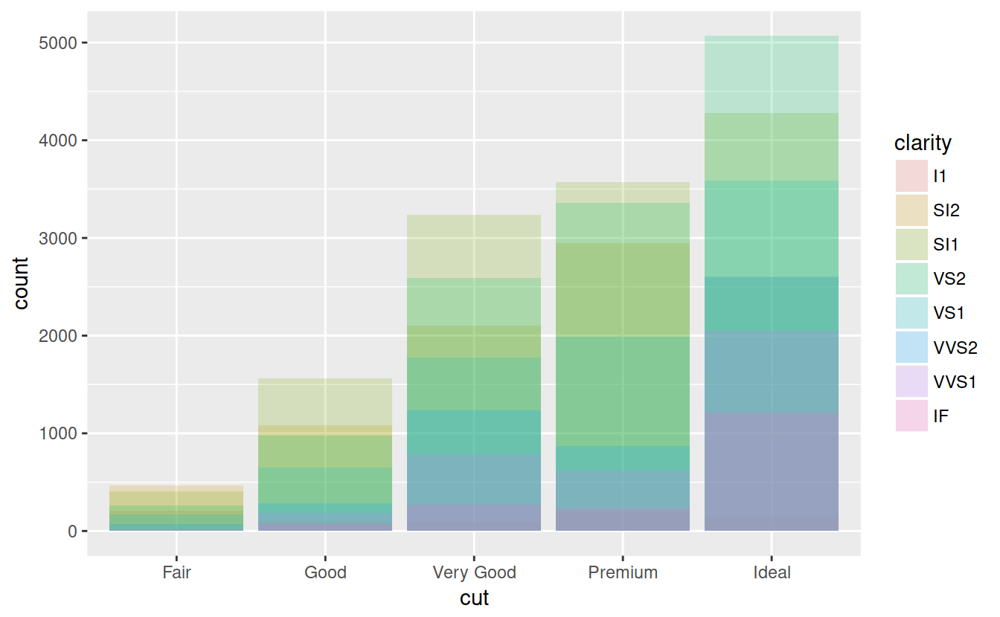

potition: fill


```r
ggplot(data = diamonds) + geom_bar(mapping = aes(x = cut, fill = clarity), position = 'fill')
```

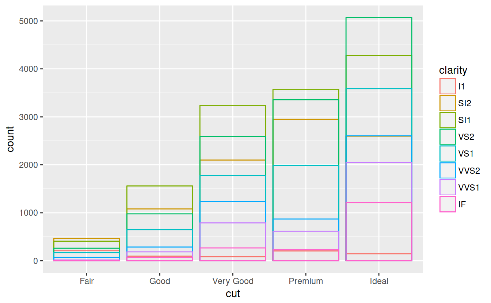

position: dodge


```r
ggplot(data = diamonds) + geom_bar(mapping = aes(x = cut, fill = clarity), position = 'dodge')
```

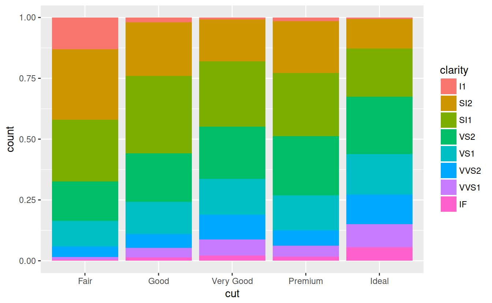


Jitter scatter plot


```r
ggplot(data = mpg) + geom_point(mapping = aes(x = displ, y = hwy))
```

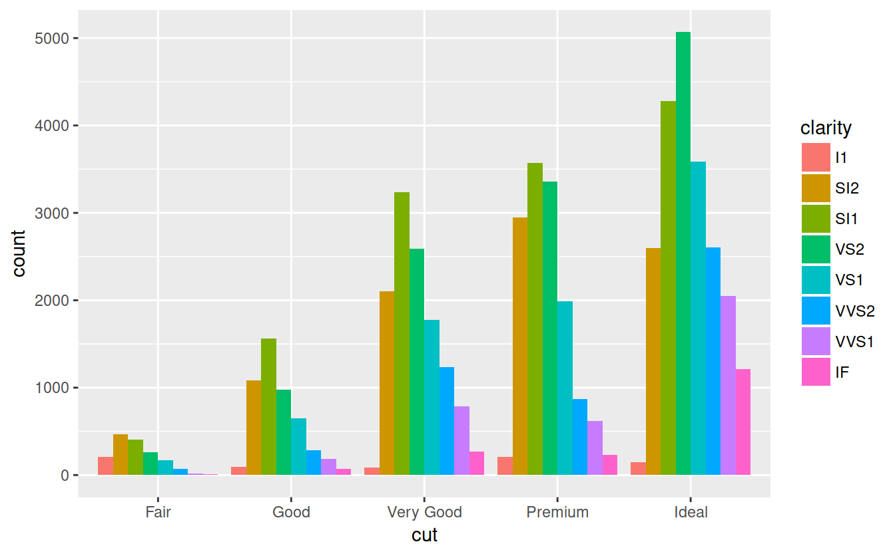


```r
ggplot(data = mpg) + geom_point(mapping = aes(x = displ, y = hwy), position = 'jitter')
```


## Coordinate Systems

coord_flipswaps the x and y axis, useful when you have long labels


```r
ggplot(data = mpg, mapping = aes(x = class, y = hwy)) + geom_boxplot()
```

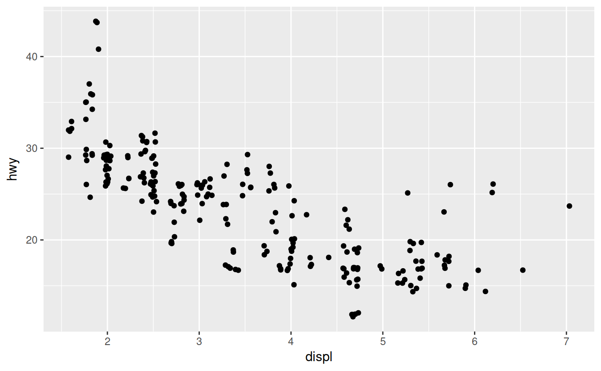


```r
ggplot(data = mpg, mapping = aes(x = class, y = hwy)) + geom_boxplot() + coord_flip()
```


coord_quickmap, sets aspect ratio for maps


```r
usa <- ggplot2::map_data('usa')
```


```r
ggplot(usa, aes(long, lat, group = group)) + geom_polygon(fill = 'white', color = 'black')
```


```r
ggplot(usa, aes(long, lat, group = group)) + geom_polygon(fill = 'white', color = 'black') + coord_quickmap()
```

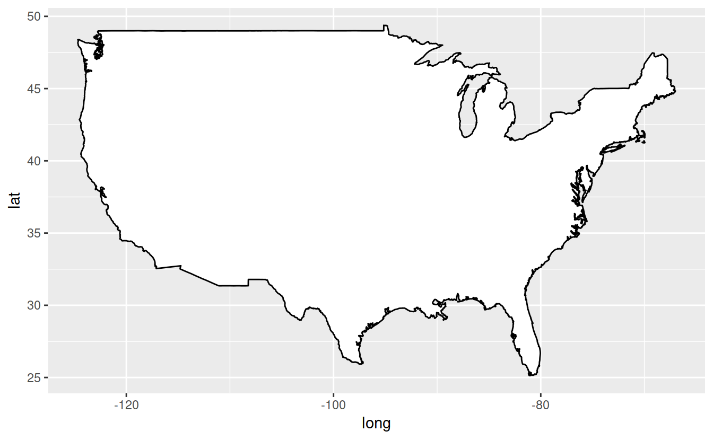

corrd_polar, uses polar coordinates


```r
bar <- ggplot(data = diamonds) +
  geom_bar(mapping = aes(x = cut, fill = cut), show.legend = FALSE, width = 1) +
  theme(aspect.ratio = 1) +
  labs(x = NULL, y = NULL)
```


```r
bar + coord_flip()
```


```r
bar + coord_polar()
```

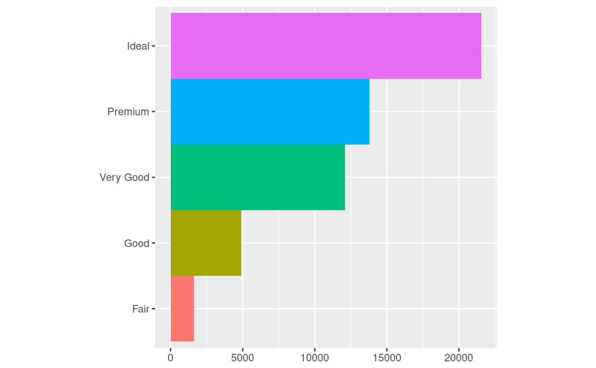


