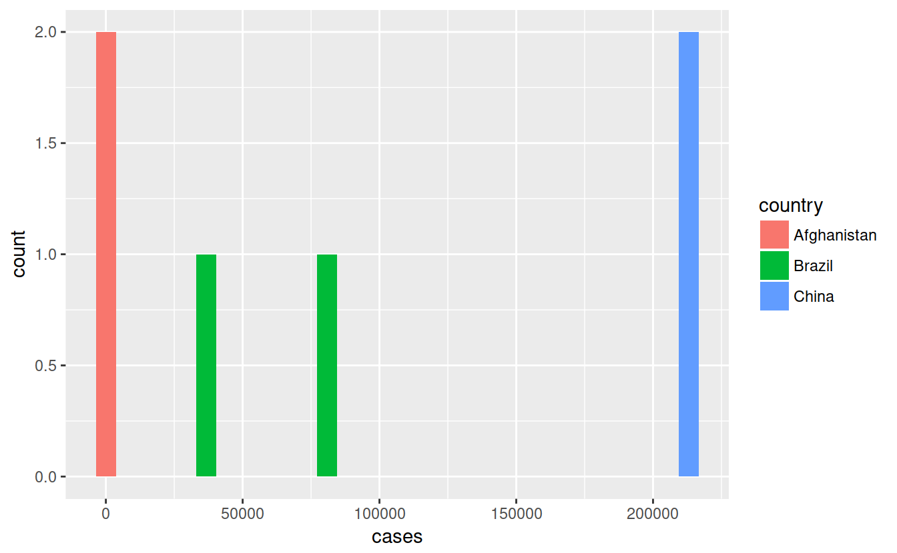

# Tidy data

Tidy data chapter is r4ds:

- http://r4ds.had.co.nz/tidy-data.html

Hadley Wickham's Tidy data paper

- http://vita.had.co.nz/papers/tidy-data.html

DataCamp Courses:

- https://www.datacamp.com/courses/cleaning-data-in-r
- https://www.datacamp.com/courses/importing-cleaning-data-in-r-case-studies

Resources

- http://tidyr.tidyverse.org/


## tidyr


```r
library(tidyr)
```


```r
table4a
## # A tibble: 3 x 3
##   country     `1999` `2000`
## * <chr>        <int>  <int>
## 1 Afghanistan    745   2666
## 2 Brazil       37737  80488
## 3 China       212258 213766
```

## Gather


```r
table4a_tidy <- gather(table4a, '2000', '1999', key = "year", value = 'cases')
```


```r
library(ggplot2)

ggplot(table4a_tidy) +
    geom_histogram(aes(x = cases, fill = country))
## `stat_bin()` using `bins = 30`. Pick better value with `binwidth`.
```




```r
(table4a_tidy <- table4a %>%
    gather('2000', '1999', key = "year", value = 'cases'))
## # A tibble: 6 x 3
##   country     year   cases
##   <chr>       <chr>  <int>
## 1 Afghanistan 2000    2666
## 2 Brazil      2000   80488
## 3 China       2000  213766
## 4 Afghanistan 1999     745
## 5 Brazil      1999   37737
## 6 China       1999  212258
```


```r
library(magrittr) # this is what actuallly gives you the pipe
## 
## Attaching package: 'magrittr'
## The following object is masked from 'package:tidyr':
## 
##     extract
```


```r
(table4b_tidy <- table4b %>%
    gather('1999':'2000', key = 'year', value = 'population'))
## # A tibble: 6 x 3
##   country     year  population
##   <chr>       <chr>      <int>
## 1 Afghanistan 1999    19987071
## 2 Brazil      1999   172006362
## 3 China       1999  1272915272
## 4 Afghanistan 2000    20595360
## 5 Brazil      2000   174504898
## 6 China       2000  1280428583
```

## Primer to joins


```r
library(dplyr)
## 
## Attaching package: 'dplyr'
## The following objects are masked from 'package:stats':
## 
##     filter, lag
## The following objects are masked from 'package:base':
## 
##     intersect, setdiff, setequal, union

# use double colon to specify which library you are getting a function from
# base::union()
```


```r
table4a_tidy
## # A tibble: 6 x 3
##   country     year   cases
##   <chr>       <chr>  <int>
## 1 Afghanistan 2000    2666
## 2 Brazil      2000   80488
## 3 China       2000  213766
## 4 Afghanistan 1999     745
## 5 Brazil      1999   37737
## 6 China       1999  212258
```


```r
table4b_tidy
## # A tibble: 6 x 3
##   country     year  population
##   <chr>       <chr>      <int>
## 1 Afghanistan 1999    19987071
## 2 Brazil      1999   172006362
## 3 China       1999  1272915272
## 4 Afghanistan 2000    20595360
## 5 Brazil      2000   174504898
## 6 China       2000  1280428583
```


```r
left_join(x = table4a_tidy, y = table4b_tidy)
## Joining, by = c("country", "year")
## # A tibble: 6 x 4
##   country     year   cases population
##   <chr>       <chr>  <int>      <int>
## 1 Afghanistan 2000    2666   20595360
## 2 Brazil      2000   80488  174504898
## 3 China       2000  213766 1280428583
## 4 Afghanistan 1999     745   19987071
## 5 Brazil      1999   37737  172006362
## 6 China       1999  212258 1272915272
```

## Spread


```r
table2
## # A tibble: 12 x 4
##    country      year type            count
##    <chr>       <int> <chr>           <int>
##  1 Afghanistan  1999 cases             745
##  2 Afghanistan  1999 population   19987071
##  3 Afghanistan  2000 cases            2666
##  4 Afghanistan  2000 population   20595360
##  5 Brazil       1999 cases           37737
##  6 Brazil       1999 population  172006362
##  7 Brazil       2000 cases           80488
##  8 Brazil       2000 population  174504898
##  9 China        1999 cases          212258
## 10 China        1999 population 1272915272
## 11 China        2000 cases          213766
## 12 China        2000 population 1280428583
```


```r
spread(table2, key = type, value = count)
## # A tibble: 6 x 4
##   country      year  cases population
##   <chr>       <int>  <int>      <int>
## 1 Afghanistan  1999    745   19987071
## 2 Afghanistan  2000   2666   20595360
## 3 Brazil       1999  37737  172006362
## 4 Brazil       2000  80488  174504898
## 5 China        1999 212258 1272915272
## 6 China        2000 213766 1280428583
```

## Separate


```r
table3
## # A tibble: 6 x 3
##   country      year rate             
## * <chr>       <int> <chr>            
## 1 Afghanistan  1999 745/19987071     
## 2 Afghanistan  2000 2666/20595360    
## 3 Brazil       1999 37737/172006362  
## 4 Brazil       2000 80488/174504898  
## 5 China        1999 212258/1272915272
## 6 China        2000 213766/1280428583
```


```r
table3 %>%
    separate(rate, into = c('cases', 'population'))
## # A tibble: 6 x 4
##   country      year cases  population
## * <chr>       <int> <chr>  <chr>     
## 1 Afghanistan  1999 745    19987071  
## 2 Afghanistan  2000 2666   20595360  
## 3 Brazil       1999 37737  172006362 
## 4 Brazil       2000 80488  174504898 
## 5 China        1999 212258 1272915272
## 6 China        2000 213766 1280428583
```


```r
table3 %>%
    separate(rate, into = c('cases', 'population'), sep = '/')
## # A tibble: 6 x 4
##   country      year cases  population
## * <chr>       <int> <chr>  <chr>     
## 1 Afghanistan  1999 745    19987071  
## 2 Afghanistan  2000 2666   20595360  
## 3 Brazil       1999 37737  172006362 
## 4 Brazil       2000 80488  174504898 
## 5 China        1999 212258 1272915272
## 6 China        2000 213766 1280428583
```
