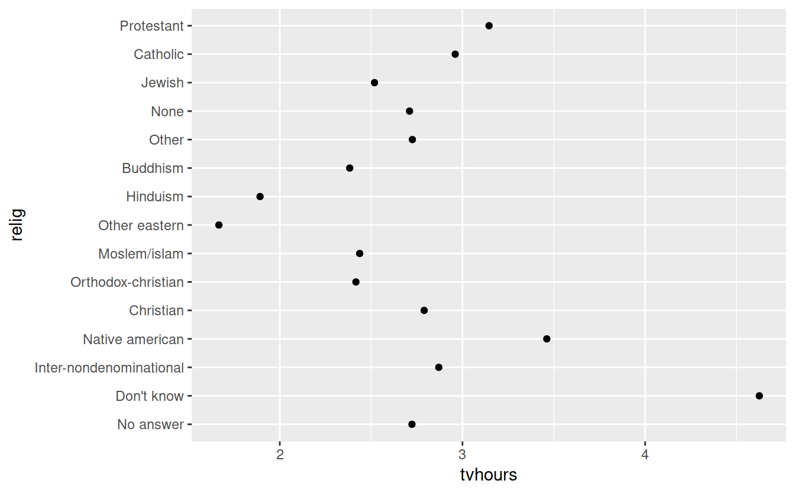

# Factors

Factors chapter in r4ds

- http://r4ds.had.co.nz/factors.html


DataCamp Courses

Resources

- http://forcats.tidyverse.org/
- https://github.com/tidyverse/forcats

## forcats


```r
library(forcats)
library(dplyr)
```

```
## 
## Attaching package: 'dplyr'
```

```
## The following objects are masked from 'package:stats':
## 
##     filter, lag
```

```
## The following objects are masked from 'package:base':
## 
##     intersect, setdiff, setequal, union
```

```r
library(ggplot2)
```


```r
x1 <- c("M", "T", "W", "R", "F", "S", "U")
x2 <- c("Sa", "Su")
```

## Sorting


```r
sort(x1)
```

```
## [1] "F" "M" "R" "S" "T" "U" "W"
```


```r
proper_order <- x1
```


```r
cat1 <- factor(x1, levels = proper_order)
cat1
```

```
## [1] M T W R F S U
## Levels: M T W R F S U
```


```r
sort(cat1)
```

```
## [1] M T W R F S U
## Levels: M T W R F S U
```


## Counting


```r
head(gss_cat)
```

```
## # A tibble: 6 x 9
##    year marital         age race  rincome  partyid   relig  denom  tvhours
##   <int> <fct>         <int> <fct> <fct>    <fct>     <fct>  <fct>    <int>
## 1  2000 Never married    26 White $8000 t… Ind,near… Prote… South…      12
## 2  2000 Divorced         48 White $8000 t… Not str … Prote… Bapti…      NA
## 3  2000 Widowed          67 White Not app… Independ… Prote… No de…       2
## 4  2000 Never married    39 White Not app… Ind,near… Ortho… Not a…       4
## 5  2000 Divorced         25 White Not app… Not str … None   Not a…       1
## 6  2000 Married          25 White $20000 … Strong d… Prote… South…      NA
```


```r
dplyr::count(gss_cat, marital)
```

```
## # A tibble: 6 x 2
##   marital           n
##   <fct>         <int>
## 1 No answer        17
## 2 Never married  5416
## 3 Separated       743
## 4 Divorced       3383
## 5 Widowed        1807
## 6 Married       10117
```


```r
gss_cat %>%
    dplyr::count(marital)
```

```
## # A tibble: 6 x 2
##   marital           n
##   <fct>         <int>
## 1 No answer        17
## 2 Never married  5416
## 3 Separated       743
## 4 Divorced       3383
## 5 Widowed        1807
## 6 Married       10117
```

## Re-ording factors


```r
library(ggplot2)
library(dplyr)

relig_summary <- gss_cat %>%
    dplyr::group_by(relig) %>%
    dplyr::summarize(
        tvhours = mean(tvhours, na.rm = TRUE),
        age = mean(age, na.rm = TRUE),
        n = n()
    )
relig_summary
```

```
## # A tibble: 15 x 4
##    relig                   tvhours   age     n
##    <fct>                     <dbl> <dbl> <int>
##  1 No answer                  2.72  49.5    93
##  2 Don't know                 4.62  35.9    15
##  3 Inter-nondenominational    2.87  40.0   109
##  4 Native american            3.46  38.9    23
##  5 Christian                  2.79  40.1   689
##  6 Orthodox-christian         2.42  50.4    95
##  7 Moslem/islam               2.44  37.6   104
##  8 Other eastern              1.67  45.9    32
##  9 Hinduism                   1.89  37.7    71
## 10 Buddhism                   2.38  44.7   147
## 11 Other                      2.73  41.0   224
## 12 None                       2.71  41.2  3523
## 13 Jewish                     2.52  52.4   388
## 14 Catholic                   2.96  46.9  5124
## 15 Protestant                 3.15  49.9 10846
```


```r
ggplot(relig_summary, aes(x = tvhours, y = relig)) +
    geom_point()
```


```r
ggplot(relig_summary, aes(x = tvhours,
                          y = fct_reorder(relig, tvhours))) +
    geom_point()
```



## Modifying factor values


```r
gss_cat %>% count(partyid)
```

```
## # A tibble: 10 x 2
##    partyid                n
##    <fct>              <int>
##  1 No answer            154
##  2 Don't know             1
##  3 Other party          393
##  4 Strong republican   2314
##  5 Not str republican  3032
##  6 Ind,near rep        1791
##  7 Independent         4119
##  8 Ind,near dem        2499
##  9 Not str democrat    3690
## 10 Strong democrat     3490
```


```r
# same as below
#forcats::fct_recode(gss_cat$partyid)
```


```r
forcats::fct_recode(gss_cat$partyid,
                        "Rep, Strong" = "Strong republican",
                        "Dem, Strong" = "Strong democrat") %>%
    head(30)
```

```
##  [1] Ind,near rep       Not str republican Independent       
##  [4] Ind,near rep       Not str democrat   Dem, Strong       
##  [7] Not str republican Ind,near dem       Not str democrat  
## [10] Rep, Strong        Not str democrat   Ind,near rep      
## [13] Dem, Strong        Rep, Strong        Ind,near dem      
## [16] Dem, Strong        Rep, Strong        Independent       
## [19] Not str democrat   Independent        Ind,near dem      
## [22] Rep, Strong        Independent        Ind,near rep      
## [25] Not str democrat   Dem, Strong        Not str democrat  
## [28] Rep, Strong        Dem, Strong        Independent       
## 10 Levels: No answer Don't know Other party ... Dem, Strong
```


```r
gss_cat_recoded <- gss_cat %>%
    mutate(party_id_recode = fct_recode(
        partyid,
        "Rep, Strong" = "Strong republican",
        "Dem, Strong" = "Strong democrat"))
```

### Double check your work

https://gist.github.com/jennybc/04b71bfaaf0f88d9d2eb


```r
# do a cross tab in R
table(gss_cat_recoded$partyid, gss_cat_recoded$party_id_recode, useNA = 'always')
```

```
##                     
##                      No answer Don't know Other party Rep, Strong
##   No answer                154          0           0           0
##   Don't know                 0          1           0           0
##   Other party                0          0         393           0
##   Strong republican          0          0           0        2314
##   Not str republican         0          0           0           0
##   Ind,near rep               0          0           0           0
##   Independent                0          0           0           0
##   Ind,near dem               0          0           0           0
##   Not str democrat           0          0           0           0
##   Strong democrat            0          0           0           0
##   <NA>                       0          0           0           0
##                     
##                      Not str republican Ind,near rep Independent
##   No answer                           0            0           0
##   Don't know                          0            0           0
##   Other party                         0            0           0
##   Strong republican                   0            0           0
##   Not str republican               3032            0           0
##   Ind,near rep                        0         1791           0
##   Independent                         0            0        4119
##   Ind,near dem                        0            0           0
##   Not str democrat                    0            0           0
##   Strong democrat                     0            0           0
##   <NA>                                0            0           0
##                     
##                      Ind,near dem Not str democrat Dem, Strong <NA>
##   No answer                     0                0           0    0
##   Don't know                    0                0           0    0
##   Other party                   0                0           0    0
##   Strong republican             0                0           0    0
##   Not str republican            0                0           0    0
##   Ind,near rep                  0                0           0    0
##   Independent                   0                0           0    0
##   Ind,near dem               2499                0           0    0
##   Not str democrat              0             3690           0    0
##   Strong democrat               0                0        3490    0
##   <NA>                          0                0           0    0
```
