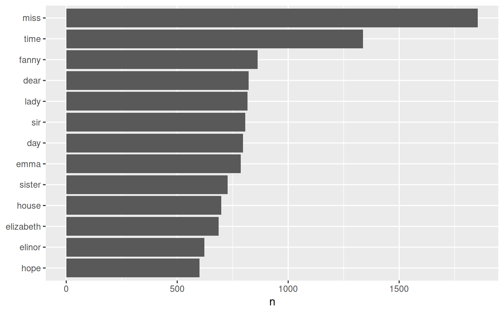
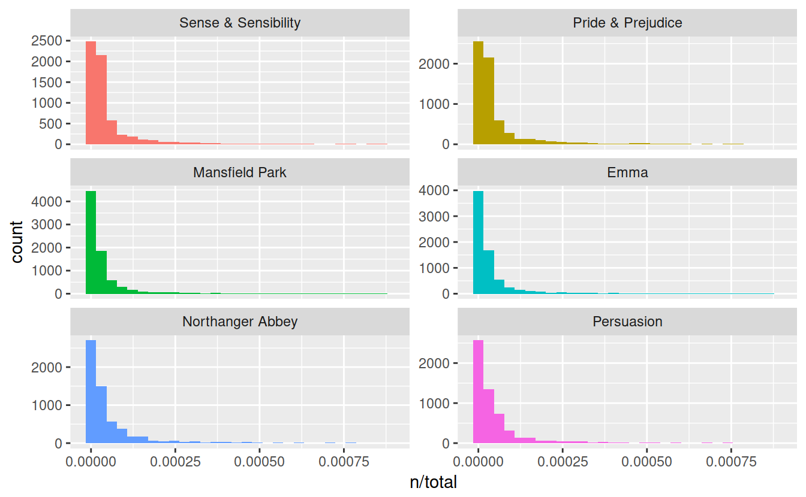
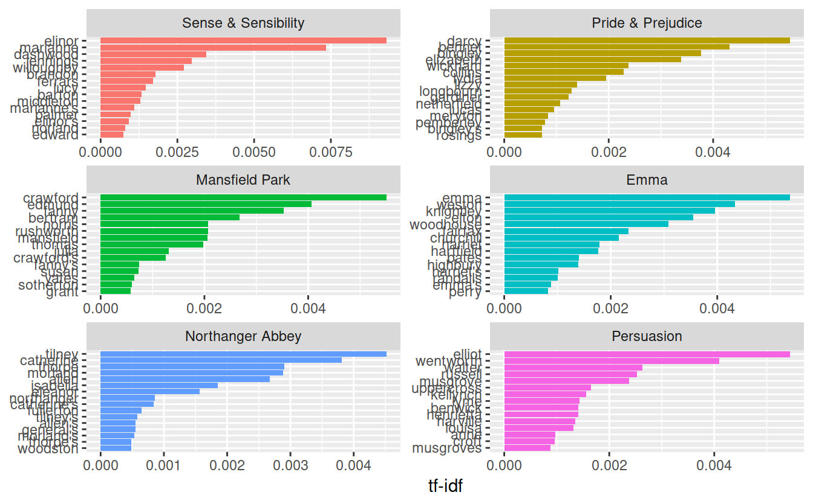
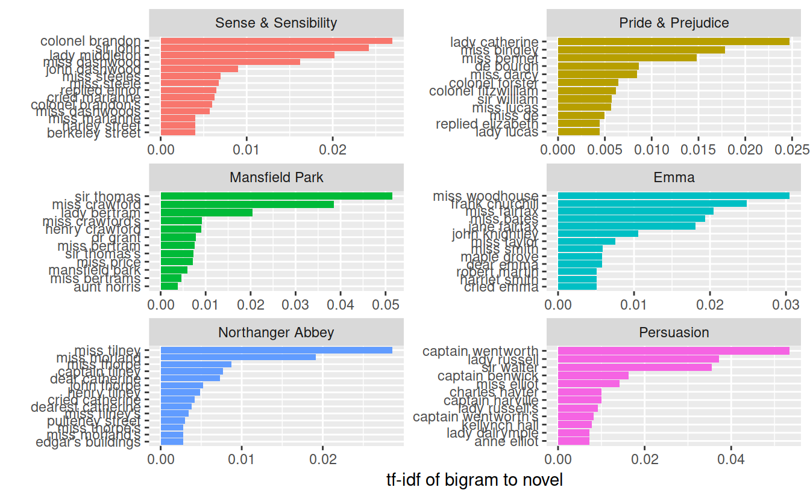

# Text Mining

Pretty much everything in this chapter comes from the "Text Mining in R" book

Book: https://www.tidytextmining.com/

Stemming:

- https://cran.r-project.org/web/packages/corpus/vignettes/stemmer.html

Datacamp:

- https://www.datacamp.com/courses/intro-to-text-mining-bag-of-words
- https://www.datacamp.com/courses/sentiment-analysis-in-r-the-tidy-way
- https://www.datacamp.com/courses/sentiment-analysis-in-r

Podcast:

- https://www.datacamp.com/community/podcast/text-mining-nlproc

Misc:

- https://www.datacamp.com/community/blog/text-mining-in-r-and-python-tips
- Drew Conway's "Beter Wordcloud": http://drewconway.com/zia/2013/3/26/building-a-better-word-cloud

(Time: 1 hour)

## One-token-per-row (unnest_tokens)

- String: Text can, of course, be stored as strings, i.e., character vectors, within R, and often text data is first read into memory in this form.
- Corpus: These types of objects typically contain raw strings annotated with additional metadata and details.
- Document-term matrix: This is a sparse matrix describing a collection (i.e., a corpus) of documents with one row for each document and one column for each term. The value in the matrix is typically word count or tf-idf (see Chapter 3).


```r
library(tibble)
```


```r
text <- c("I'm your basic average girl",
          "And I'm here to save the world",
          "You can't stop me",
          "Cause I'm Kim Pos-si-ble")
```


```r
text
## [1] "I'm your basic average girl"    "And I'm here to save the world"
## [3] "You can't stop me"              "Cause I'm Kim Pos-si-ble"
```


```r
text_df <- data_frame(line = 1:4, text = text)
text_df
## # A tibble: 4 x 2
##    line text                          
##   <int> <chr>                         
## 1     1 I'm your basic average girl   
## 2     2 And I'm here to save the world
## 3     3 You can't stop me             
## 4     4 Cause I'm Kim Pos-si-ble
```


```r
library(tidytext)
library(magrittr)

text_df %>%
  unnest_tokens(word, text)
## # A tibble: 22 x 2
##     line word   
##    <int> <chr>  
##  1     1 i'm    
##  2     1 your   
##  3     1 basic  
##  4     1 average
##  5     1 girl   
##  6     2 and    
##  7     2 i'm    
##  8     2 here   
##  9     2 to     
## 10     2 save   
## # ... with 12 more rows
```

## Jane Austen


```r
library(janeaustenr)
library(dplyr)
## 
## Attaching package: 'dplyr'
## The following objects are masked from 'package:stats':
## 
##     filter, lag
## The following objects are masked from 'package:base':
## 
##     intersect, setdiff, setequal, union
library(stringr)
```


```r
austen_books()
## # A tibble: 73,422 x 2
##    text                  book               
##  * <chr>                 <fct>              
##  1 SENSE AND SENSIBILITY Sense & Sensibility
##  2 ""                    Sense & Sensibility
##  3 by Jane Austen        Sense & Sensibility
##  4 ""                    Sense & Sensibility
##  5 (1811)                Sense & Sensibility
##  6 ""                    Sense & Sensibility
##  7 ""                    Sense & Sensibility
##  8 ""                    Sense & Sensibility
##  9 ""                    Sense & Sensibility
## 10 CHAPTER 1             Sense & Sensibility
## # ... with 73,412 more rows
```


```r
original_books <- austen_books() %>%
  group_by(book) %>%
  mutate(linenumber = row_number(),
         chapter = cumsum(str_detect(text, regex("^chapter [\\divxlc]",
                                                 ignore_case = TRUE)))) %>%
  ungroup()

original_books
## # A tibble: 73,422 x 4
##    text                  book                linenumber chapter
##    <chr>                 <fct>                    <int>   <int>
##  1 SENSE AND SENSIBILITY Sense & Sensibility          1       0
##  2 ""                    Sense & Sensibility          2       0
##  3 by Jane Austen        Sense & Sensibility          3       0
##  4 ""                    Sense & Sensibility          4       0
##  5 (1811)                Sense & Sensibility          5       0
##  6 ""                    Sense & Sensibility          6       0
##  7 ""                    Sense & Sensibility          7       0
##  8 ""                    Sense & Sensibility          8       0
##  9 ""                    Sense & Sensibility          9       0
## 10 CHAPTER 1             Sense & Sensibility         10       1
## # ... with 73,412 more rows
```


```r
library(tidytext)
tidy_books <- original_books %>%
  unnest_tokens(word, text)

tidy_books
## # A tibble: 725,055 x 4
##    book                linenumber chapter word       
##    <fct>                    <int>   <int> <chr>      
##  1 Sense & Sensibility          1       0 sense      
##  2 Sense & Sensibility          1       0 and        
##  3 Sense & Sensibility          1       0 sensibility
##  4 Sense & Sensibility          3       0 by         
##  5 Sense & Sensibility          3       0 jane       
##  6 Sense & Sensibility          3       0 austen     
##  7 Sense & Sensibility          5       0 1811       
##  8 Sense & Sensibility         10       1 chapter    
##  9 Sense & Sensibility         10       1 1          
## 10 Sense & Sensibility         13       1 the        
## # ... with 725,045 more rows
```


## Stop words and Frequencies


```r
tidy_books %>%
  count(word, sort = TRUE) 
## # A tibble: 14,520 x 2
##    word      n
##    <chr> <int>
##  1 the   26351
##  2 to    24044
##  3 and   22515
##  4 of    21178
##  5 a     13408
##  6 her   13055
##  7 i     12006
##  8 in    11217
##  9 was   11204
## 10 it    10234
## # ... with 14,510 more rows
```


```r
data(stop_words)

tidy_books <- tidy_books %>%
  anti_join(stop_words)
## Joining, by = "word"
```


```r
tidy_books %>%
  count(word, sort = TRUE) 
## # A tibble: 13,914 x 2
##    word       n
##    <chr>  <int>
##  1 miss    1855
##  2 time    1337
##  3 fanny    862
##  4 dear     822
##  5 lady     817
##  6 sir      806
##  7 day      797
##  8 emma     787
##  9 sister   727
## 10 house    699
## # ... with 13,904 more rows
```


```r
library(ggplot2)

tidy_books %>%
  count(word, sort = TRUE) %>%
  filter(n > 600) %>%
  mutate(word = reorder(word, n)) %>%
  ggplot(aes(word, n)) +
  geom_col() +
  xlab(NULL) +
  coord_flip()
```



## gutenbergr package

gutenbergr package provides access to the public domain works from the Project Gutenberg collection

## Sentiment Analytis


```r
library(tidytext)

sentiments
## # A tibble: 27,314 x 4
##    word        sentiment lexicon score
##    <chr>       <chr>     <chr>   <int>
##  1 abacus      trust     nrc        NA
##  2 abandon     fear      nrc        NA
##  3 abandon     negative  nrc        NA
##  4 abandon     sadness   nrc        NA
##  5 abandoned   anger     nrc        NA
##  6 abandoned   fear      nrc        NA
##  7 abandoned   negative  nrc        NA
##  8 abandoned   sadness   nrc        NA
##  9 abandonment anger     nrc        NA
## 10 abandonment fear      nrc        NA
## # ... with 27,304 more rows
```

3 main sentiment dictionaries (based on single words)

- AFINN from Finn Årup Nielsen
    - assigns words with a score that runs between -5 and 5, with negative scores indicating negative sentiment and positive scores indicating positive sentiment
- bing from Bing Liu and collaborators
    - binary fashion into positive and negative categories.
- nrc from Saif Mohammad and Peter Turney.
    - binary fashion (“yes”/“no”) into categories of positive, negative, anger, anticipation, disgust, fear, joy, sadness,surprise, and trust.
    - 


```r
get_sentiments("afinn")
## # A tibble: 2,476 x 2
##    word       score
##    <chr>      <int>
##  1 abandon       -2
##  2 abandoned     -2
##  3 abandons      -2
##  4 abducted      -2
##  5 abduction     -2
##  6 abductions    -2
##  7 abhor         -3
##  8 abhorred      -3
##  9 abhorrent     -3
## 10 abhors        -3
## # ... with 2,466 more rows
```


```r
get_sentiments("bing")
## # A tibble: 6,788 x 2
##    word        sentiment
##    <chr>       <chr>    
##  1 2-faced     negative 
##  2 2-faces     negative 
##  3 a+          positive 
##  4 abnormal    negative 
##  5 abolish     negative 
##  6 abominable  negative 
##  7 abominably  negative 
##  8 abominate   negative 
##  9 abomination negative 
## 10 abort       negative 
## # ... with 6,778 more rows
```


```r
get_sentiments("nrc")
## # A tibble: 13,901 x 2
##    word        sentiment
##    <chr>       <chr>    
##  1 abacus      trust    
##  2 abandon     fear     
##  3 abandon     negative 
##  4 abandon     sadness  
##  5 abandoned   anger    
##  6 abandoned   fear     
##  7 abandoned   negative 
##  8 abandoned   sadness  
##  9 abandonment anger    
## 10 abandonment fear     
## # ... with 13,891 more rows
```


```r
library(janeaustenr)
library(dplyr)
library(stringr)

tidy_books <- austen_books() %>%
  group_by(book) %>%
  mutate(linenumber = row_number(),
         chapter = cumsum(str_detect(text, regex("^chapter [\\divxlc]", 
                                                 ignore_case = TRUE)))) %>%
  ungroup() %>%
  unnest_tokens(word, text)
```


```r
nrc_joy <- get_sentiments("nrc") %>% 
  filter(sentiment == "joy")

tidy_books %>%
  filter(book == "Emma") %>%
  inner_join(nrc_joy) %>%
  count(word, sort = TRUE)
## Joining, by = "word"
## # A tibble: 303 x 2
##    word        n
##    <chr>   <int>
##  1 good      359
##  2 young     192
##  3 friend    166
##  4 hope      143
##  5 happy     125
##  6 love      117
##  7 deal       92
##  8 found      92
##  9 present    89
## 10 kind       82
## # ... with 293 more rows
```

## tf-idf: Term frequency, inverse document frequency

what a document is about by looking at the words.

tf-idf: measure how important a word is to a document in a collection (or corpus) of documents


```r
library(dplyr)
library(janeaustenr)
library(tidytext)

book_words <- austen_books() %>%
  unnest_tokens(word, text) %>%
  count(book, word, sort = TRUE) %>%
  ungroup()

total_words <- book_words %>% 
  group_by(book) %>% 
  summarize(total = sum(n))

book_words <- left_join(book_words, total_words)
## Joining, by = "book"

book_words
## # A tibble: 40,379 x 4
##    book              word      n  total
##    <fct>             <chr> <int>  <int>
##  1 Mansfield Park    the    6206 160460
##  2 Mansfield Park    to     5475 160460
##  3 Mansfield Park    and    5438 160460
##  4 Emma              to     5239 160996
##  5 Emma              the    5201 160996
##  6 Emma              and    4896 160996
##  7 Mansfield Park    of     4778 160460
##  8 Pride & Prejudice the    4331 122204
##  9 Emma              of     4291 160996
## 10 Pride & Prejudice to     4162 122204
## # ... with 40,369 more rows
```

Term frequency (standarized)


```r
library(ggplot2)

ggplot(book_words, aes(n/total, fill = book)) +
  geom_histogram(show.legend = FALSE) +
  xlim(NA, 0.0009) +
  facet_wrap(~book, ncol = 2, scales = "free_y")
## `stat_bin()` using `bins = 30`. Pick better value with `binwidth`.
## Warning: Removed 896 rows containing non-finite values (stat_bin).
```



Zipf’s law states that the frequency that a word appears is inversely proportional to its rank.


find the important words for the content of each document by decreasing the weight for commonly used words and increasing the weight for words that are not used very much in a collection or corpus of documents

## bind_tf_idf

https://en.wikipedia.org/wiki/Tf%E2%80%93idf:

- tf: The weight of a term that occurs in a document is simply proportional to the term frequency
- idf: The specificity of a term can be quantified as an inverse function of the number of documents in which it occurs


```r
book_words <- book_words %>%
  bind_tf_idf(word, book, n)
book_words
## # A tibble: 40,379 x 7
##    book              word      n  total     tf   idf tf_idf
##    <fct>             <chr> <int>  <int>  <dbl> <dbl>  <dbl>
##  1 Mansfield Park    the    6206 160460 0.0387     0      0
##  2 Mansfield Park    to     5475 160460 0.0341     0      0
##  3 Mansfield Park    and    5438 160460 0.0339     0      0
##  4 Emma              to     5239 160996 0.0325     0      0
##  5 Emma              the    5201 160996 0.0323     0      0
##  6 Emma              and    4896 160996 0.0304     0      0
##  7 Mansfield Park    of     4778 160460 0.0298     0      0
##  8 Pride & Prejudice the    4331 122204 0.0354     0      0
##  9 Emma              of     4291 160996 0.0267     0      0
## 10 Pride & Prejudice to     4162 122204 0.0341     0      0
## # ... with 40,369 more rows
```

Get high tf-idf scores


```r
book_words %>%
  select(-total) %>%
  arrange(desc(tf_idf))
## # A tibble: 40,379 x 6
##    book                word          n      tf   idf  tf_idf
##    <fct>               <chr>     <int>   <dbl> <dbl>   <dbl>
##  1 Sense & Sensibility elinor      623 0.00519  1.79 0.00931
##  2 Sense & Sensibility marianne    492 0.00410  1.79 0.00735
##  3 Mansfield Park      crawford    493 0.00307  1.79 0.00551
##  4 Pride & Prejudice   darcy       373 0.00305  1.79 0.00547
##  5 Persuasion          elliot      254 0.00304  1.79 0.00544
##  6 Emma                emma        786 0.00488  1.10 0.00536
##  7 Northanger Abbey    tilney      196 0.00252  1.79 0.00452
##  8 Emma                weston      389 0.00242  1.79 0.00433
##  9 Pride & Prejudice   bennet      294 0.00241  1.79 0.00431
## 10 Persuasion          wentworth   191 0.00228  1.79 0.00409
## # ... with 40,369 more rows
```


```r
book_words %>%
  arrange(desc(tf_idf)) %>%
  mutate(word = factor(word, levels = rev(unique(word)))) %>% 
  group_by(book) %>% 
  top_n(15) %>% 
  ungroup %>%
  ggplot(aes(word, tf_idf, fill = book)) +
  geom_col(show.legend = FALSE) +
  labs(x = NULL, y = "tf-idf") +
  facet_wrap(~book, ncol = 2, scales = "free") +
  coord_flip()
## Selecting by tf_idf
```




## Relationships (n-grams)


```r
library(dplyr)
library(tidytext)
library(janeaustenr)

austen_bigrams <- austen_books() %>%
  unnest_tokens(bigram, text, token = "ngrams", n = 2)

austen_bigrams
## # A tibble: 725,049 x 2
##    book                bigram         
##    <fct>               <chr>          
##  1 Sense & Sensibility sense and      
##  2 Sense & Sensibility and sensibility
##  3 Sense & Sensibility sensibility by 
##  4 Sense & Sensibility by jane        
##  5 Sense & Sensibility jane austen    
##  6 Sense & Sensibility austen 1811    
##  7 Sense & Sensibility 1811 chapter   
##  8 Sense & Sensibility chapter 1      
##  9 Sense & Sensibility 1 the          
## 10 Sense & Sensibility the family     
## # ... with 725,039 more rows
```


```r
austen_bigrams %>%
  count(bigram, sort = TRUE)
## # A tibble: 211,236 x 2
##    bigram       n
##    <chr>    <int>
##  1 of the    3017
##  2 to be     2787
##  3 in the    2368
##  4 it was    1781
##  5 i am      1545
##  6 she had   1472
##  7 of her    1445
##  8 to the    1387
##  9 she was   1377
## 10 had been  1299
## # ... with 211,226 more rows
```

Remove stop words and get new counts


```r
library(tidyr)
## 
## Attaching package: 'tidyr'
## The following object is masked from 'package:magrittr':
## 
##     extract

bigrams_separated <- austen_bigrams %>%
  separate(bigram, c("word1", "word2"), sep = " ")

bigrams_filtered <- bigrams_separated %>%
  filter(!word1 %in% stop_words$word) %>%
  filter(!word2 %in% stop_words$word)

# new bigram counts:
bigram_counts <- bigrams_filtered %>% 
  count(word1, word2, sort = TRUE)

bigram_counts
## # A tibble: 33,421 x 3
##    word1   word2         n
##    <chr>   <chr>     <int>
##  1 sir     thomas      287
##  2 miss    crawford    215
##  3 captain wentworth   170
##  4 miss    woodhouse   162
##  5 frank   churchill   132
##  6 lady    russell     118
##  7 lady    bertram     114
##  8 sir     walter      113
##  9 miss    fairfax     109
## 10 colonel brandon     108
## # ... with 33,411 more rows
```

go back to bi-grams


```r
bigrams_united <- bigrams_filtered %>%
  unite(bigram, word1, word2, sep = " ")

bigrams_united
## # A tibble: 44,784 x 2
##    book                bigram                  
##    <fct>               <chr>                   
##  1 Sense & Sensibility jane austen             
##  2 Sense & Sensibility austen 1811             
##  3 Sense & Sensibility 1811 chapter            
##  4 Sense & Sensibility chapter 1               
##  5 Sense & Sensibility norland park            
##  6 Sense & Sensibility surrounding acquaintance
##  7 Sense & Sensibility late owner              
##  8 Sense & Sensibility advanced age            
##  9 Sense & Sensibility constant companion      
## 10 Sense & Sensibility happened ten            
## # ... with 44,774 more rows
```

Analyzing bi-grams


```r
bigrams_filtered %>%
  filter(word2 == "street") %>%
  count(book, word1, sort = TRUE)
## # A tibble: 34 x 3
##    book                word1           n
##    <fct>               <chr>       <int>
##  1 Sense & Sensibility berkeley       16
##  2 Sense & Sensibility harley         16
##  3 Northanger Abbey    pulteney       14
##  4 Northanger Abbey    milsom         11
##  5 Mansfield Park      wimpole        10
##  6 Pride & Prejudice   gracechurch     9
##  7 Sense & Sensibility conduit         6
##  8 Sense & Sensibility bond            5
##  9 Persuasion          milsom          5
## 10 Persuasion          rivers          4
## # ... with 24 more rows
```


```r
bigram_tf_idf <- bigrams_united %>%
  count(book, bigram) %>%
  bind_tf_idf(bigram, book, n) %>%
  arrange(desc(tf_idf))

bigram_tf_idf
## # A tibble: 36,217 x 6
##    book                bigram                n     tf   idf tf_idf
##    <fct>               <chr>             <int>  <dbl> <dbl>  <dbl>
##  1 Persuasion          captain wentworth   170 0.0299  1.79 0.0535
##  2 Mansfield Park      sir thomas          287 0.0287  1.79 0.0515
##  3 Mansfield Park      miss crawford       215 0.0215  1.79 0.0386
##  4 Persuasion          lady russell        118 0.0207  1.79 0.0371
##  5 Persuasion          sir walter          113 0.0198  1.79 0.0356
##  6 Emma                miss woodhouse      162 0.0170  1.79 0.0305
##  7 Northanger Abbey    miss tilney          82 0.0159  1.79 0.0286
##  8 Sense & Sensibility colonel brandon     108 0.0150  1.79 0.0269
##  9 Emma                frank churchill     132 0.0139  1.79 0.0248
## 10 Pride & Prejudice   lady catherine      100 0.0138  1.79 0.0247
## # ... with 36,207 more rows
```


```r
library(ggplot2)

bigram_tf_idf %>%
  arrange(desc(tf_idf)) %>%
  group_by(book) %>%
  top_n(12, tf_idf) %>%
  ungroup() %>%
  mutate(bigram = reorder(bigram, tf_idf)) %>%
  ggplot(aes(bigram, tf_idf, fill = book)) +
  geom_col(show.legend = FALSE) +
  facet_wrap(~ book, ncol = 2, scales = "free") +
  coord_flip() +
  labs(y = "tf-idf of bigram to novel",
       x = "")
```



## Stemming

https://cran.r-project.org/web/packages/corpus/vignettes/stemmer.html


```r
library(corpus)
```


```r
text <- "love loving lovingly loved lover lovely love"
text_tokens(text, stemmer = "en") # english stemmer
## [[1]]
## [1] "love"  "love"  "love"  "love"  "lover" "love"  "love"
```

Using `tm`


```r
library(tm)
## Loading required package: NLP
## 
## Attaching package: 'NLP'
## The following object is masked from 'package:ggplot2':
## 
##     annotate
```


```r
complicate <- c("complicated", "complication", "complicatedly")
```


```r
stemDocument(complicate)
## [1] "complic" "complic" "complic"
```
