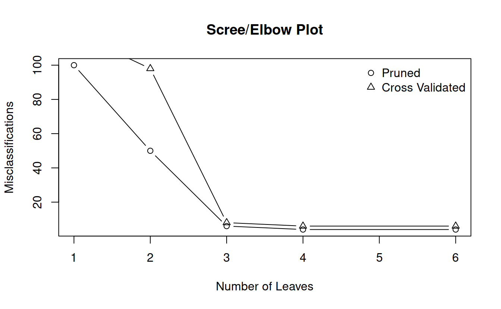
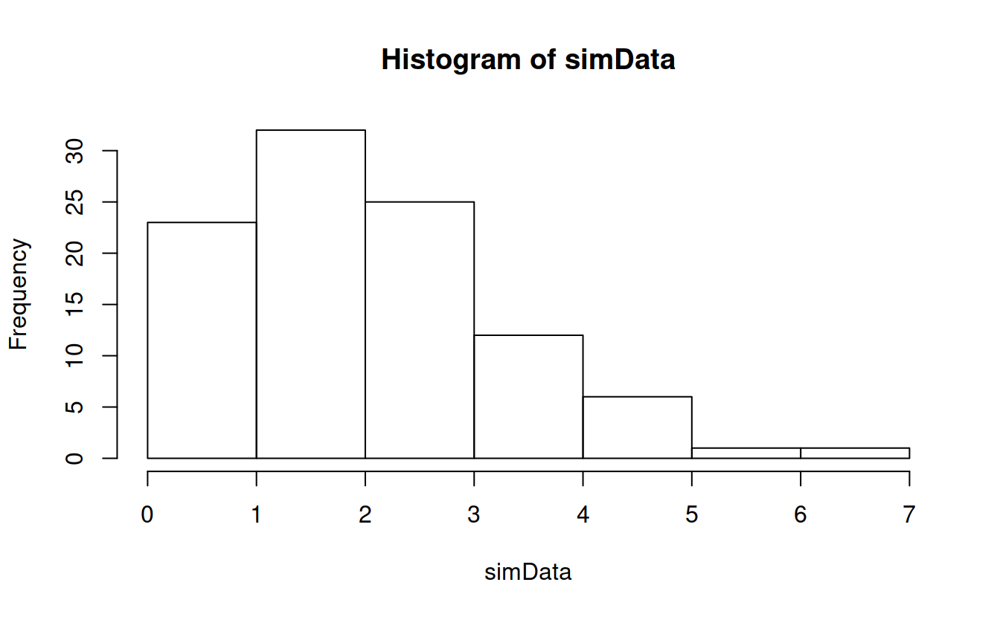
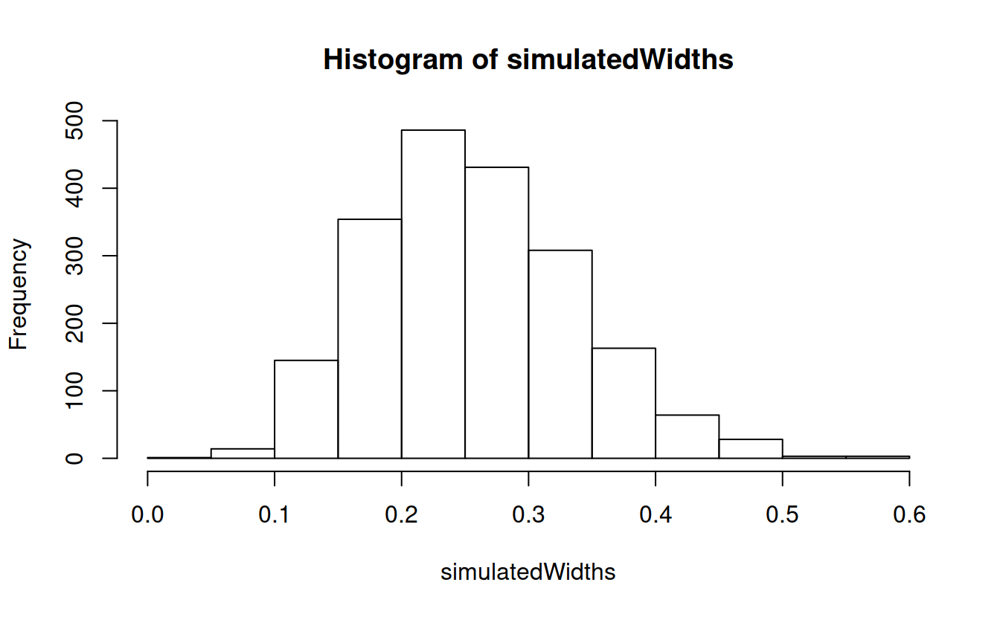

# Random Forests

DataCamp:

- https://www.datacamp.com/courses/machine-learning-with-tree-based-models-in-r
- https://campus.datacamp.com/courses/kaggle-r-tutorial-on-machine-learning/chapter-2-from-icebergs-to-trees?ex=1

Articles:

- https://www.datacamp.com/community/tutorials/decision-trees-R

## CART


```r
library(ggplot2)
library(tree)
```


```r
# Data
summary(iris)
##   Sepal.Length    Sepal.Width     Petal.Length    Petal.Width   
##  Min.   :4.300   Min.   :2.000   Min.   :1.000   Min.   :0.100  
##  1st Qu.:5.100   1st Qu.:2.800   1st Qu.:1.600   1st Qu.:0.300  
##  Median :5.800   Median :3.000   Median :4.350   Median :1.300  
##  Mean   :5.843   Mean   :3.057   Mean   :3.758   Mean   :1.199  
##  3rd Qu.:6.400   3rd Qu.:3.300   3rd Qu.:5.100   3rd Qu.:1.800  
##  Max.   :7.900   Max.   :4.400   Max.   :6.900   Max.   :2.500  
##        Species  
##  setosa    :50  
##  versicolor:50  
##  virginica :50  
##                 
##                 
## 
```


```r
ggplot(data = iris) + geom_point(aes(x = Petal.Length, y = Petal.Width, col = Species))
```


The idea behind CART is to divide the predictor space (petal width and length) with a straight line and fit simple models on either side of the line. 

Mathematically, consider predictors $X_j$ and some split point $s$ that splits the predictor space into two half-spaces $$L_{j, s} = \lbrace X |X_j \le s \rbrace \text{ and } R_{j, s} = \lbrace X |X_j > s\rbrace$$. 

The idea is to split on the varible and at the location which minimizes some loss function: $$min_{j, s}\lbrace loss(R_{j, s}) + loss(L_{j, s}) \rbrace$$
For classification problems, the easiest model is ``majority wins'' and the loss function is the number of misclassificed observations. For regression, the easiest model is the mean model, and the loss function is squared error loss.


```r
# Grow a tree
classTree = tree(Species ~ Sepal.Length + Sepal.Width + Petal.Length + Petal.Width, data = iris)
```


```r
summary(classTree)
## 
## Classification tree:
## tree(formula = Species ~ Sepal.Length + Sepal.Width + Petal.Length + 
##     Petal.Width, data = iris)
## Variables actually used in tree construction:
## [1] "Petal.Length" "Petal.Width"  "Sepal.Length"
## Number of terminal nodes:  6 
## Residual mean deviance:  0.1253 = 18.05 / 144 
## Misclassification error rate: 0.02667 = 4 / 150
```


```r
plot(classTree)
text(classTree)
```


```r
table(predict(classTree, type = 'class'), iris$Species)
##             
##              setosa versicolor virginica
##   setosa         50          0         0
##   versicolor      0         47         1
##   virginica       0          3        49
```


Trees, left unattended, can easily overfit. Loss can always be reduced to zero by cutting the predictor space up enough. The two major ways to hadle this is the Bayesian approach of putting priors on trees, or a penalized loss function approach, which adds a penalty for more complex trees (mode leaves).

It's common practice to grow a tree too large and then prune it back, rather than just stop growing the tree when it gets too complex. This explores tree space more thoroughly. Once we have our overgrown tree we remove terminal nodes and try to minimize a penalized loss function. For a tree with $T$ nodes labelled $N_t$ for $t \in 1, \ldots, T$ we want to minimize

$$k T + \sum_{t = 1}^{T}loss(N_t)$$
where k is a parameter controlling the penalty on the tree size. Harsher penalties lead to smaller trees.


```r
# Prune that tree!
prune = prune.tree(classTree, method = 'misclass')
prune
## $size
## [1] 6 4 3 2 1
## 
## $dev
## [1]   4   4   6  50 100
## 
## $k
## [1] -Inf    0    2   44   50
## 
## $method
## [1] "misclass"
## 
## attr(,"class")
## [1] "prune"         "tree.sequence"
```


```r
plot(prune$size, prune$dev, main = "Scree/Elbow Plot", xlab = "Number of Leaves", ylab = "Misclassifications")
```


```r
# Cross validation
cvTree = cv.tree(classTree, method = 'misclass')
cvTree
## $size
## [1] 6 4 3 2 1
## 
## $dev
## [1]   6   6   8  98 119
## 
## $k
## [1] -Inf    0    2   44   50
## 
## $method
## [1] "misclass"
## 
## attr(,"class")
## [1] "prune"         "tree.sequence"
```


```r
plot(prune$size, prune$dev, main = "Scree/Elbow Plot", xlab = "Number of Leaves", ylab = "Misclassifications", type = 'b')
points(cvTree$size, cvTree$dev, type = 'b', pch = 2)
legend("topright", pch = 1:2, legend = c("Pruned", "Cross Validated"), bty = 'n')
```



Other methods use a significance test approach to determining whether or not to split. For each variable, the model performs a univariate hypothesis test and splits on the variable with the lowest p-value. If no null hypotheses can be rejected, the tree stops splitting.


```r
library(party)
## Loading required package: methods
## Loading required package: grid
## Loading required package: mvtnorm
## Loading required package: modeltools
## Loading required package: stats4
## Loading required package: strucchange
## Loading required package: zoo
## 
## Attaching package: 'zoo'
## The following objects are masked from 'package:base':
## 
##     as.Date, as.Date.numeric
## Loading required package: sandwich
```


```r
ciTree = ctree(Species ~ Sepal.Length + Sepal.Width + Petal.Length + Petal.Width, data = iris)
ciTree
## 
## 	 Conditional inference tree with 4 terminal nodes
## 
## Response:  Species 
## Inputs:  Sepal.Length, Sepal.Width, Petal.Length, Petal.Width 
## Number of observations:  150 
## 
## 1) Petal.Length <= 1.9; criterion = 1, statistic = 140.264
##   2)*  weights = 50 
## 1) Petal.Length > 1.9
##   3) Petal.Width <= 1.7; criterion = 1, statistic = 67.894
##     4) Petal.Length <= 4.8; criterion = 0.999, statistic = 13.865
##       5)*  weights = 46 
##     4) Petal.Length > 4.8
##       6)*  weights = 8 
##   3) Petal.Width > 1.7
##     7)*  weights = 46
```


```r
plot(ciTree)
```


A main advantage of trees is their ease of interpretability and use. 

```r
library(DAAG)
## Loading required package: lattice
data(spam7)
head(spam7)
##   crl.tot dollar  bang money n000 make yesno
## 1     278  0.000 0.778  0.00 0.00 0.00     y
## 2    1028  0.180 0.372  0.43 0.43 0.21     y
## 3    2259  0.184 0.276  0.06 1.16 0.06     y
## 4     191  0.000 0.137  0.00 0.00 0.00     y
## 5     191  0.000 0.135  0.00 0.00 0.00     y
## 6      54  0.000 0.000  0.00 0.00 0.00     y
```


```r
spamTree = ctree(yesno ~., data = spam7)
spamTree
## 
## 	 Conditional inference tree with 20 terminal nodes
## 
## Response:  yesno 
## Inputs:  crl.tot, dollar, bang, money, n000, make 
## Number of observations:  4601 
## 
## 1) n000 <= 0.12; criterion = 1, statistic = 515.579
##   2) dollar <= 0.055; criterion = 1, statistic = 393.255
##     3) bang <= 0.102; criterion = 1, statistic = 129.53
##       4) bang <= 0.028; criterion = 1, statistic = 29.259
##         5) money <= 0.13; criterion = 0.998, statistic = 12.684
##           6)*  weights = 2154 
##         5) money > 0.13
##           7)*  weights = 24 
##       4) bang > 0.028
##         8) money <= 0; criterion = 1, statistic = 23.253
##           9) bang <= 0.034; criterion = 0.953, statistic = 7.03
##             10)*  weights = 19 
##           9) bang > 0.034
##             11) dollar <= 0.04; criterion = 0.982, statistic = 8.779
##               12)*  weights = 170 
##             11) dollar > 0.04
##               13)*  weights = 15 
##         8) money > 0
##           14)*  weights = 21 
##     3) bang > 0.102
##       15) crl.tot <= 86; criterion = 1, statistic = 64.968
##         16) crl.tot <= 51; criterion = 1, statistic = 24.737
##           17) money <= 1.16; criterion = 1, statistic = 19.282
##             18)*  weights = 330 
##           17) money > 1.16
##             19)*  weights = 8 
##         16) crl.tot > 51
##           20)*  weights = 184 
##       15) crl.tot > 86
##         21) bang <= 0.471; criterion = 1, statistic = 37.344
##           22) money <= 0; criterion = 1, statistic = 20.151
##             23) crl.tot <= 321; criterion = 0.963, statistic = 7.487
##               24)*  weights = 152 
##             23) crl.tot > 321
##               25)*  weights = 58 
##           22) money > 0
##             26)*  weights = 43 
##         21) bang > 0.471
##           27)*  weights = 180 
##   2) dollar > 0.055
##     28) bang <= 0.075; criterion = 1, statistic = 35.434
##       29) money <= 0.16; criterion = 1, statistic = 27.115
##         30)*  weights = 138 
##       29) money > 0.16
##         31)*  weights = 67 
##     28) bang > 0.075
##       32)*  weights = 436 
## 1) n000 > 0.12
##   33) bang <= 0; criterion = 1, statistic = 21.155
##     34)*  weights = 49 
##   33) bang > 0
##     35) n000 <= 0.25; criterion = 0.973, statistic = 8.025
##       36) n000 <= 0.19; criterion = 0.96, statistic = 7.343
##         37)*  weights = 43 
##       36) n000 > 0.19
##         38)*  weights = 21 
##     35) n000 > 0.25
##       39)*  weights = 489
```


```r
plot(spamTree)
```


Let's predict an email!

How well does it predict?

```r
spamTreeConfusionMatrix = table(predict(spamTree, spam7), spam7$yesno)
spamTreeConfusionMatrix
##    
##        n    y
##   n 2683  503
##   y  105 1310
```


```r
sum(diag(spamTreeConfusionMatrix))/sum(spamTreeConfusionMatrix) #86.7%
## [1] 0.8678548
```


```r
# Let's do a simple cross validation
inSampleProp = .85
inSampleIndicator = sample(c(TRUE, FALSE), size = nrow(spam7), replace = TRUE, prob = c(inSampleProp, 1 - inSampleProp))
trainingSet = spam7[inSampleIndicator,]
testingSet = spam7[!inSampleIndicator,]
trainingTree = ctree(yesno ~., data = trainingSet)
trainingTree
## 
## 	 Conditional inference tree with 20 terminal nodes
## 
## Response:  yesno 
## Inputs:  crl.tot, dollar, bang, money, n000, make 
## Number of observations:  3906 
## 
## 1) dollar <= 0.055; criterion = 1, statistic = 474.384
##   2) bang <= 0.085; criterion = 1, statistic = 107.911
##     3) bang <= 0.028; criterion = 1, statistic = 22.15
##       4) n000 <= 0.11; criterion = 1, statistic = 16.097
##         5) money <= 0.03; criterion = 0.998, statistic = 12.534
##           6)*  weights = 1794 
##         5) money > 0.03
##           7)*  weights = 23 
##       4) n000 > 0.11
##         8)*  weights = 31 
##     3) bang > 0.028
##       9)*  weights = 161 
##   2) bang > 0.085
##     10) crl.tot <= 85; criterion = 1, statistic = 70.548
##       11) crl.tot <= 51; criterion = 1, statistic = 19.938
##         12) money <= 0.48; criterion = 1, statistic = 16.228
##           13)*  weights = 293 
##         12) money > 0.48
##           14)*  weights = 7 
##       11) crl.tot > 51
##         15)*  weights = 169 
##     10) crl.tot > 85
##       16) bang <= 0.448; criterion = 1, statistic = 36.142
##         17) money <= 0; criterion = 1, statistic = 17.308
##           18) n000 <= 0.1; criterion = 0.955, statistic = 7.13
##             19) crl.tot <= 321; criterion = 0.972, statistic = 7.991
##               20)*  weights = 142 
##             19) crl.tot > 321
##               21)*  weights = 54 
##           18) n000 > 0.1
##             22)*  weights = 10 
##         17) money > 0
##           23) money <= 1.05; criterion = 0.984, statistic = 8.964
##             24)*  weights = 62 
##           23) money > 1.05
##             25)*  weights = 7 
##       16) bang > 0.448
##         26)*  weights = 181 
## 1) dollar > 0.055
##   27) bang <= 0.049; criterion = 1, statistic = 39.757
##     28) n000 <= 0.39; criterion = 1, statistic = 22.383
##       29) money <= 0.16; criterion = 1, statistic = 22.929
##         30)*  weights = 114 
##       29) money > 0.16
##         31)*  weights = 53 
##     28) n000 > 0.39
##       32)*  weights = 35 
##   27) bang > 0.049
##     33) crl.tot <= 39; criterion = 0.994, statistic = 10.79
##       34)*  weights = 16 
##     33) crl.tot > 39
##       35) crl.tot <= 411; criterion = 0.981, statistic = 8.653
##         36) bang <= 0.407; criterion = 0.994, statistic = 10.723
##           37)*  weights = 220 
##         36) bang > 0.407
##           38)*  weights = 189 
##       35) crl.tot > 411
##         39)*  weights = 345
```


```r
plot(trainingTree)
```


Now we can do a more fair out of sample calculation

```r
# In-sample
inSampleMat = table(predict(trainingTree, trainingSet), trainingSet$yesno)
inSampleMat
##    
##        n    y
##   n 2287  440
##   y   69 1110
```


```r
sum(diag(inSampleMat))/sum(inSampleMat)
## [1] 0.8696877
```


```r
# Out of sample
outSampleMat = table(predict(trainingTree, testingSet), testingSet$yesno)
outSampleMat
##    
##       n   y
##   n 423  86
##   y   9 177
```


```r
sum(diag(outSampleMat))/sum(outSampleMat)
## [1] 0.8633094
```


## Bootstrapping

How can we estimate the variability in a statistic? Let's say we want a probability interval for the mean of some data.

```r
n = 100
simData = rgamma(n, 2, 1)
# True mean: 2
hist(simData)
```




```r
mean(simData)
## [1] 2.04451
```

One option is to rely on normal theory and write,

$$var(\bar{x}) = \frac{1}{n}var(x),$$
then use the right normal score to get the ``confidence interval'' you want:


```r
xbar = mean(simData)
xsd = sd(simData)
# 95% interval
confInt = xbar + c(-1.96, 1.96) * (xsd/sqrt(n))
confInt
## [1] 1.800013 2.289007
```
The accuracy of this estimate depends on the extent to which the data are normal. We know the data are from a rather skewed gamma, how much does that skewness affect the interval? How could we find out?

What if we had some large number of samples, say m,  of the mean computed from $n$ samples of this population? This is an awful idea in practice, but bear with me.

```r
m = 2000
simulatedMeans = numeric(m)
# don't need for loop for this
for (i in 1:m) simulatedMeans[i] = mean(rgamma(n, 2, 1))
```


```r
quantile(simulatedMeans, c(.025, .975))
##     2.5%    97.5% 
## 1.734263 2.283977
```


```r
confInt
## [1] 1.800013 2.289007
```


We can visualize this:


```r
plotSequence = seq(min(simulatedMeans), max(simulatedMeans), length = 1000)
hist(simulatedMeans, prob = TRUE, sub = "Line is the normal approximation density")
lines(plotSequence, dnorm(plotSequence, mean = xbar, sd = xsd/sqrt(n)))
```


Obviously, we can't just get a thousand means to estimate its variability, but we can do something close by resampling from our original data. This is called bootstrapping.


```r
# b represents the number of bootstrap samples
b = 2000
bootstrapMeans = numeric(b)
for(i in 1:b){
  resample = sample(simData, n, replace = TRUE)
  bootstrapMeans[i] = mean(resample)
} 
```


```r
quantile(simulatedMeans, c(.025, .975))
##     2.5%    97.5% 
## 1.734263 2.283977
```


```r
quantile(bootstrapMeans, c(.025, .975))
##     2.5%    97.5% 
## 1.807087 2.300364
```


```r
confInt
## [1] 1.800013 2.289007
```


```r
hist(simulatedMeans, prob = TRUE, sub = "Line is the normal approximation density", col = rgb(1, 0, 0, .2))
hist(bootstrapMeans, prob = TRUE, col = rgb(0, 0, 1, .2), add = TRUE)
lines(plotSequence, dnorm(plotSequence, mean = xbar, sd = xsd/sqrt(n)))
legend("topright", bty = 'n', fill = c("red", "blue"), legend = c("True Mean Dist", "Bootstrap Dist"))
```


We see that this strange resampling technique seems to work well when we want to find a mean, at least as well as the normal approximation. Its true strength lies in estimating variability in more exotic statistics. For example, what is the variability in the width of the 95\% confidence probability interval for our gamma data?


```r
confintWidth = function(data){
  upperAndLowerBounds = quantile(data, c(.025, .095))
  width = diff(upperAndLowerBounds)
  names(width) = NULL
  return(width)
}
```


```r
confintWidth(simData)
## [1] 0.1734299
```


```r
m = 2000
simulatedWidths = numeric(m)
for (i in 1:m) simulatedWidths[i] = confintWidth(rgamma(n, 2, 1))

quantile(simulatedWidths, c(.025, .975))
##      2.5%     97.5% 
## 0.1232144 0.4330531
```


```r
hist(simulatedWidths)
```




```r
b = 2000
bootstrapWidths = numeric(b)
for(i in 1:b){
  resample = sample(simData, n, replace = TRUE)
  bootstrapWidths[i] = confintWidth(resample)
} 
```


```r
quantile(simulatedWidths, c(.025, .975))
##      2.5%     97.5% 
## 0.1232144 0.4330531
```


```r
quantile(bootstrapWidths, c(.025, .975))
##       2.5%      97.5% 
## 0.07638408 0.47030471
```


```r
hist(simulatedWidths, prob = TRUE, col = rgb(1, 0, 0, .2))
hist(bootstrapWidths, prob = TRUE, col = rgb(0, 0, 1, .2), add = TRUE)
legend("topright", bty = 'n', fill = c("red", "blue"), legend = c("True Mean Dist", "Bootstrap Dist"))
```


We can do this with any function at all!


```r
compareBootstrapToTruth = function(functionToCompare, sampleSize = 100, resamples = 1000, plot = FALSE, ret = FALSE){
  
  data = rgamma(sampleSize, 2, 1)
  trueSamples = numeric(resamples)
  bootstrapSamples = numeric(resamples)
  if(class(functionToCompare(data)) != "numeric") stop("Function must return a scalar.")
  
  for(i in 1:m){
    trueSamples[i] = functionToCompare(rgamma(sampleSize, 2, 1))
    resample = sample(data, sampleSize, replace = TRUE)
    bootstrapSamples[i] = functionToCompare(resample)
  } 
  
  if(plot){
    trueHist = hist(trueSamples, plot = FALSE)
    bootHist = hist(bootstrapSamples, plot = FALSE)
    hist(trueSamples, prob = TRUE, col = rgb(1, 0, 0, .2), main = "", xlab = "Sample Values", ylim = c(0, max(trueHist$density, bootHist$density)))
    hist(bootstrapSamples, prob = TRUE, col = rgb(0, 0, 1, .2), add = TRUE)
    legend("topright", bty = 'n', fill = c("red", "blue"), legend = c("True Dist", "Bootstrap Dist"))
  }
  out = list(trueSamples = trueSamples, bootstrapSamples = bootstrapSamples)
  if(ret) return(out)
}
```


```r
compareBootstrapToTruth(mean, plot = TRUE)
```


```r
compareBootstrapToTruth(confintWidth, plot = TRUE)
```


## Bagging

Just as bootstrapping can estimate variability for statistics, it can also do so for predictions. This process is known as Bootstrap AGGrigation, or bagging. It turns out that, when doing bootstrap sampling, about 1/3 of the entries don't make it into the resampled data set. These points are called out-of-bag (oob), and the rest are in-bag. We can use oob data like a free testing set. First a simple example to illustrate, then a non-trivial one.


```r
mpgLm = lm(mpg ~ hp + wt, data = mtcars)
summary(mpgLm)
## 
## Call:
## lm(formula = mpg ~ hp + wt, data = mtcars)
## 
## Residuals:
##    Min     1Q Median     3Q    Max 
## -3.941 -1.600 -0.182  1.050  5.854 
## 
## Coefficients:
##             Estimate Std. Error t value Pr(>|t|)    
## (Intercept) 37.22727    1.59879  23.285  < 2e-16 ***
## hp          -0.03177    0.00903  -3.519  0.00145 ** 
## wt          -3.87783    0.63273  -6.129 1.12e-06 ***
## ---
## Signif. codes:  0 '***' 0.001 '**' 0.01 '*' 0.05 '.' 0.1 ' ' 1
## 
## Residual standard error: 2.593 on 29 degrees of freedom
## Multiple R-squared:  0.8268,	Adjusted R-squared:  0.8148 
## F-statistic: 69.21 on 2 and 29 DF,  p-value: 9.109e-12
```


```r
b = 2000
oobPredictions = matrix(NA, nrow = nrow(mtcars), ncol = b)
for(i in 1:b){
  resampleIndices = sample(1:nrow(mtcars), nrow(mtcars), replace = TRUE)
  # use the set difference to find the out of bag indices
  oobIndices = setdiff(1:nrow(mtcars), resampleIndices)
  
  bootstrapMtcars = mtcars[resampleIndices, ]
  oobMtcars = mtcars[oobIndices,]
  bootstrapLm = lm(mpg ~ hp + wt, data = bootstrapMtcars)
  oobPreds = predict(bootstrapLm, oobMtcars)
  oobPredictions[oobIndices, i] = oobPreds
} 
```


```r
oobPredictions[, 1:5]
##            [,1]     [,2]     [,3]     [,4]      [,5]
##  [1,] 22.494587       NA       NA       NA        NA
##  [2,]        NA       NA       NA 22.96562 23.440193
##  [3,]        NA 26.11981       NA 25.36036        NA
##  [4,] 19.798269 22.41944 21.68780 22.00558 22.124690
##  [5,]        NA       NA 18.56648       NA 18.649486
##  [6,] 18.786115 21.87208       NA       NA        NA
##  [7,]        NA       NA       NA       NA        NA
##  [8,] 20.853263       NA 23.58794       NA 24.144853
##  [9,]        NA       NA       NA 22.91937        NA
## [10,]        NA       NA 20.54729 20.73738        NA
## [11,]        NA       NA       NA 20.73738        NA
## [12,]        NA       NA 16.56916       NA        NA
## [13,]        NA       NA 17.54429 17.14356 17.327081
## [14,]        NA       NA 17.40089 17.00238        NA
## [15,]  8.712622 11.28819 12.23258       NA        NA
## [16,]        NA       NA       NA 10.65639  9.370276
## [17,]  7.791647       NA       NA       NA        NA
## [18,] 25.261098       NA       NA       NA        NA
## [19,] 28.186763 30.36620       NA       NA 30.639444
## [20,] 26.934760       NA 27.35984       NA        NA
## [21,] 23.452033       NA       NA       NA        NA
## [22,] 17.631370       NA       NA       NA 19.341744
## [23,]        NA 19.78221 19.53314       NA 19.670620
## [24,]        NA       NA       NA       NA        NA
## [25,] 15.668121       NA       NA       NA        NA
## [26,] 26.461979       NA       NA       NA 28.840321
## [27,]        NA       NA       NA       NA 27.045361
## [28,]        NA       NA 26.45490 26.66537        NA
## [29,]        NA 15.13692       NA 14.63539        NA
## [30,] 20.539619 20.71671       NA       NA 21.241801
## [31,]        NA 10.42526       NA 10.04940 11.735052
## [32,]        NA       NA 22.97348       NA 23.847832
```


```r
predict(mpgLm, mtcars[1,], interval = "confidence")
##                fit      lwr      upr
## Mazda RX4 23.57233 22.45623 24.68843
```


```r
quantile(oobPredictions[1,], c(.025, .975), na.rm = TRUE)
##     2.5%    97.5% 
## 22.41650 24.74866
```

We see the bootstrap confidence interval is very close to the normal theory interval, as was the case above. This isn't super useful for linear models, but gives us a way to measure uncertainty for models which don't have a probability model to give us error bars, such as CART.

Now, we bag cart. We'll use the very first example.


```r
classTree = tree(Species ~ Sepal.Length + Sepal.Width + Petal.Length + Petal.Width, data = iris)
```


```r
summary(classTree)
## 
## Classification tree:
## tree(formula = Species ~ Sepal.Length + Sepal.Width + Petal.Length + 
##     Petal.Width, data = iris)
## Variables actually used in tree construction:
## [1] "Petal.Length" "Petal.Width"  "Sepal.Length"
## Number of terminal nodes:  6 
## Residual mean deviance:  0.1253 = 18.05 / 144 
## Misclassification error rate: 0.02667 = 4 / 150
```


```r
plot(classTree)
text(classTree)
```


```r
table(predict(classTree, type = 'class'), iris$Species)
##             
##              setosa versicolor virginica
##   setosa         50          0         0
##   versicolor      0         47         1
##   virginica       0          3        49
```


```r
b = 2000
oobPredictions = matrix(NA, nrow = nrow(iris), ncol = b)
for(i in 1:b){
  resampleIndices = sample(1:nrow(iris), nrow(iris), replace = TRUE)
  # use the set difference to find the out of bag indices
  oobIndices = setdiff(1:nrow(iris), resampleIndices)
  
  bootstrapIris= iris[resampleIndices, ]
  oobIris = iris[oobIndices,]
  bsTree = tree(Species ~ Sepal.Length + Sepal.Width + Petal.Length + Petal.Width, data = bootstrapIris)
  oobPreds = predict(bsTree, oobIris, type = 'class')
  oobPredictions[oobIndices, i] = oobPreds
} 
```

Let's look at some results!

```r
oobPredictions[, 1:5]
##        [,1] [,2] [,3] [,4] [,5]
##   [1,]    1   NA    1   NA    1
##   [2,]   NA   NA   NA   NA   NA
##   [3,]   NA    1    1   NA    1
##   [4,]    1   NA   NA   NA   NA
##   [5,]   NA   NA    1   NA    1
##   [6,]    1   NA   NA   NA    1
##   [7,]    1   NA    1    1   NA
##   [8,]   NA   NA   NA   NA   NA
##   [9,]   NA   NA   NA   NA   NA
##  [10,]   NA   NA   NA    1   NA
##  [11,]   NA   NA   NA   NA   NA
##  [12,]   NA   NA    1   NA    1
##  [13,]   NA    1    1   NA   NA
##  [14,]   NA   NA    1   NA    1
##  [15,]    1    1    1   NA    1
##  [16,]    1    1    1   NA    1
##  [17,]   NA   NA   NA   NA   NA
##  [18,]   NA   NA   NA   NA    1
##  [19,]   NA    1   NA    1    1
##  [20,]   NA   NA   NA    1   NA
##  [21,]   NA   NA    1   NA    1
##  [22,]    1   NA    1    1   NA
##  [23,]   NA   NA   NA    1   NA
##  [24,]    1    1    1    1   NA
##  [25,]   NA   NA    1    1    1
##  [26,]    1   NA    1   NA   NA
##  [27,]   NA   NA   NA   NA    1
##  [28,]   NA    1   NA    1    1
##  [29,]   NA   NA   NA    1    1
##  [30,]   NA   NA   NA   NA   NA
##  [31,]    1   NA   NA    1   NA
##  [32,]   NA    1    1    1    1
##  [33,]   NA    1   NA   NA   NA
##  [34,]   NA    1   NA   NA   NA
##  [35,]    1    1   NA   NA    1
##  [36,]   NA   NA   NA    1    1
##  [37,]    1    1    1    1    1
##  [38,]   NA    1   NA    1   NA
##  [39,]   NA   NA   NA    1    1
##  [40,]    1   NA   NA   NA   NA
##  [41,]   NA   NA    1   NA   NA
##  [42,]   NA   NA   NA    1   NA
##  [43,]    1    1    1   NA    1
##  [44,]    1   NA    1   NA    1
##  [45,]    1   NA   NA   NA   NA
##  [46,]   NA   NA   NA   NA   NA
##  [47,]   NA   NA    1    1   NA
##  [48,]   NA    1   NA   NA   NA
##  [49,]   NA   NA    1   NA    1
##  [50,]   NA    1   NA   NA    1
##  [51,]    2   NA   NA    2   NA
##  [52,]   NA   NA    2   NA   NA
##  [53,]   NA   NA    2   NA    2
##  [54,]    2   NA    2    2    2
##  [55,]   NA   NA    2   NA   NA
##  [56,]    2   NA   NA   NA   NA
##  [57,]   NA   NA   NA    2   NA
##  [58,]    2   NA   NA   NA   NA
##  [59,]   NA   NA   NA    2    2
##  [60,]   NA   NA   NA   NA    2
##  [61,]    2   NA   NA   NA   NA
##  [62,]   NA    2   NA   NA   NA
##  [63,]   NA    2   NA   NA   NA
##  [64,]    2   NA    2   NA   NA
##  [65,]   NA   NA   NA   NA    2
##  [66,]   NA    2   NA   NA   NA
##  [67,]   NA   NA   NA   NA   NA
##  [68,]   NA   NA   NA   NA    2
##  [69,]    2   NA   NA    2   NA
##  [70,]   NA    2   NA   NA   NA
##  [71,]   NA   NA   NA    3    3
##  [72,]    2   NA   NA    2    2
##  [73,]    2   NA   NA   NA   NA
##  [74,]   NA    2   NA    2   NA
##  [75,]    2   NA    2    2   NA
##  [76,]   NA   NA    2   NA   NA
##  [77,]   NA   NA   NA   NA    2
##  [78,]   NA   NA    3    3   NA
##  [79,]    2   NA    2   NA   NA
##  [80,]    2   NA   NA    2   NA
##  [81,]   NA    2    2   NA    2
##  [82,]    2   NA   NA   NA   NA
##  [83,]   NA   NA    2   NA   NA
##  [84,]   NA    3   NA    3   NA
##  [85,]   NA    2   NA   NA   NA
##  [86,]    2    3   NA   NA   NA
##  [87,]    2    2    2    2   NA
##  [88,]   NA    2   NA   NA   NA
##  [89,]    2   NA    2    2   NA
##  [90,]   NA   NA   NA   NA   NA
##  [91,]   NA    2   NA    2   NA
##  [92,]   NA   NA   NA    2   NA
##  [93,]   NA    2    2   NA   NA
##  [94,]   NA    2   NA   NA   NA
##  [95,]   NA   NA   NA    2    2
##  [96,]   NA    2    2   NA   NA
##  [97,]    2   NA   NA   NA   NA
##  [98,]   NA    2    2   NA    2
##  [99,]    2   NA    2   NA    2
## [100,]   NA   NA    2   NA   NA
## [101,]    3   NA    3   NA   NA
## [102,]   NA   NA   NA   NA   NA
## [103,]    3   NA    3   NA    3
## [104,]   NA    3    3    3    3
## [105,]   NA    3   NA   NA   NA
## [106,]   NA    3   NA   NA    3
## [107,]    2   NA   NA   NA   NA
## [108,]   NA    3   NA   NA   NA
## [109,]   NA   NA   NA    3   NA
## [110,]    3   NA    3   NA   NA
## [111,]    3   NA    3   NA    3
## [112,]   NA   NA    3   NA   NA
## [113,]   NA   NA   NA   NA    3
## [114,]   NA   NA   NA    3    3
## [115,]   NA   NA   NA    3   NA
## [116,]    3    3   NA    3    3
## [117,]   NA    3    3   NA   NA
## [118,]    3   NA   NA   NA    3
## [119,]    3   NA    3    3    3
## [120,]    2   NA    3    3   NA
## [121,]   NA    3    3   NA   NA
## [122,]   NA    3   NA   NA   NA
## [123,]   NA   NA   NA    3    3
## [124,]    3   NA    3   NA   NA
## [125,]   NA    3   NA    3   NA
## [126,]   NA   NA    3    3   NA
## [127,]   NA   NA    3   NA   NA
## [128,]   NA    3    3   NA   NA
## [129,]   NA   NA   NA   NA   NA
## [130,]    2   NA   NA   NA   NA
## [131,]   NA    3   NA    3   NA
## [132,]    3    3   NA   NA   NA
## [133,]   NA   NA    3   NA    3
## [134,]    2    3   NA    3    2
## [135,]    2   NA   NA   NA   NA
## [136,]   NA    3   NA   NA    3
## [137,]   NA   NA   NA   NA   NA
## [138,]   NA    3    3   NA   NA
## [139,]    3    3   NA    3    3
## [140,]   NA    3   NA    3    3
## [141,]   NA   NA    3    3    3
## [142,]    3   NA   NA    3   NA
## [143,]   NA   NA   NA   NA    3
## [144,]   NA   NA    3   NA   NA
## [145,]   NA    3   NA   NA   NA
## [146,]    3    3   NA   NA    3
## [147,]   NA   NA   NA   NA    3
## [148,]   NA   NA    3   NA   NA
## [149,]    3    3   NA   NA   NA
## [150,]   NA   NA   NA   NA    3
```


```r
bsPreds = cbind(prob1 = apply(oobPredictions, 1, function(x) sum(x == 1, na.rm = TRUE)),
                prob2 = apply(oobPredictions, 1, function(x) sum(x == 2, na.rm = TRUE)),
                prob3 = apply(oobPredictions, 1, function(x) sum(x == 3, na.rm = TRUE)))
bsPreds = bsPreds / rowSums(bsPreds)
bsPreds = cbind(bsPreds, Species = iris$Species)
bsPreds[c(1:10, 51:60, 101:110), ]
##       prob1       prob2       prob3 Species
##  [1,]     1 0.000000000 0.000000000       1
##  [2,]     1 0.000000000 0.000000000       1
##  [3,]     1 0.000000000 0.000000000       1
##  [4,]     1 0.000000000 0.000000000       1
##  [5,]     1 0.000000000 0.000000000       1
##  [6,]     1 0.000000000 0.000000000       1
##  [7,]     1 0.000000000 0.000000000       1
##  [8,]     1 0.000000000 0.000000000       1
##  [9,]     1 0.000000000 0.000000000       1
## [10,]     1 0.000000000 0.000000000       1
## [11,]     0 0.998641304 0.001358696       2
## [12,]     0 1.000000000 0.000000000       2
## [13,]     0 0.556016598 0.443983402       2
## [14,]     0 0.995720399 0.004279601       2
## [15,]     0 0.985207101 0.014792899       2
## [16,]     0 0.998630137 0.001369863       2
## [17,]     0 0.882993197 0.117006803       2
## [18,]     0 0.995934959 0.004065041       2
## [19,]     0 1.000000000 0.000000000       2
## [20,]     0 0.998632011 0.001367989       2
## [21,]     0 0.000000000 1.000000000       3
## [22,]     0 0.002699055 0.997300945       3
## [23,]     0 0.000000000 1.000000000       3
## [24,]     0 0.001385042 0.998614958       3
## [25,]     0 0.000000000 1.000000000       3
## [26,]     0 0.000000000 1.000000000       3
## [27,]     0 0.848360656 0.151639344       3
## [28,]     0 0.001394700 0.998605300       3
## [29,]     0 0.001367989 0.998632011       3
## [30,]     0 0.000000000 1.000000000       3
```

Congratulations, we just fit a random forest!

Let's see where the model is uncertain.

```r
uncertainty = apply(bsPreds[,1:3], 1, function(x) 1/var(x))
ggplot(data = iris) + geom_point(aes(x = Petal.Length, y = Petal.Width, col = Species, size = uncertainty))
```


As expected, the model is perfectly sure about setosa, but uncertain on the boundary between versicolo and virginica.

## Viewing Random Forests

The last part of the course will introduce you to the random forest package, some nifty things you can do with it, and some visuals.
IMPORTANT NOTE!!! This implementation of random forest can't handle catgegorical predictors directly. You need to convert them to a model matrix. This isn't that hard, but if you're not aware of it you can get spurious results


```r
library(randomForest)
## randomForest 4.6-14
## Type rfNews() to see new features/changes/bug fixes.
## 
## Attaching package: 'randomForest'
## The following object is masked from 'package:ggplot2':
## 
##     margin
mtcarsRf = randomForest(mpg ~ ., data=mtcars, importance=TRUE, proximity=TRUE, mtry = 4)
mtcarsRf
## 
## Call:
##  randomForest(formula = mpg ~ ., data = mtcars, importance = TRUE,      proximity = TRUE, mtry = 4) 
##                Type of random forest: regression
##                      Number of trees: 500
## No. of variables tried at each split: 4
## 
##           Mean of squared residuals: 5.424577
##                     % Var explained: 84.58
```


```r
plot(mtcarsRf)
```


Variable importance.

```r
varImportance = importance(mtcarsRf, type = 2)
varImportance
##      IncNodePurity
## cyl     189.275498
## disp    262.391424
## hp      205.431608
## drat     45.489344
## wt      278.369216
## qsec     19.915649
## vs        9.846512
## am        8.995382
## gear      9.776913
## carb     19.251604
```


```r
layout(matrix(c(1,1,2,1,1,3,1, 1, 4), nrow = 3, ncol = 3, byrow = TRUE))
varImpPlot(mtcarsRf, type = 2)
impvar = rownames(varImportance)[order(varImportance[, 1], decreasing=TRUE)]
colors = c("black", "blue", "red")
for(j in 1:3){
  partialPlot(mtcarsRf, mtcars, impvar[j], main = "",xlab = impvar[j], lwd= 3, cex.lab = 2, n.pt = 100)
}
```


A neat output of an RF model is a measure of proximity between rows. Proximity is the proportion of times two observations appear in the same leaf node. This can be very useful in cases where rows contain both continuous and categorical data, a typically difficult situation for most metrics.

If we do 1 - proximity we can turn this into a distance matrix and do things like multidimensional scaling.
