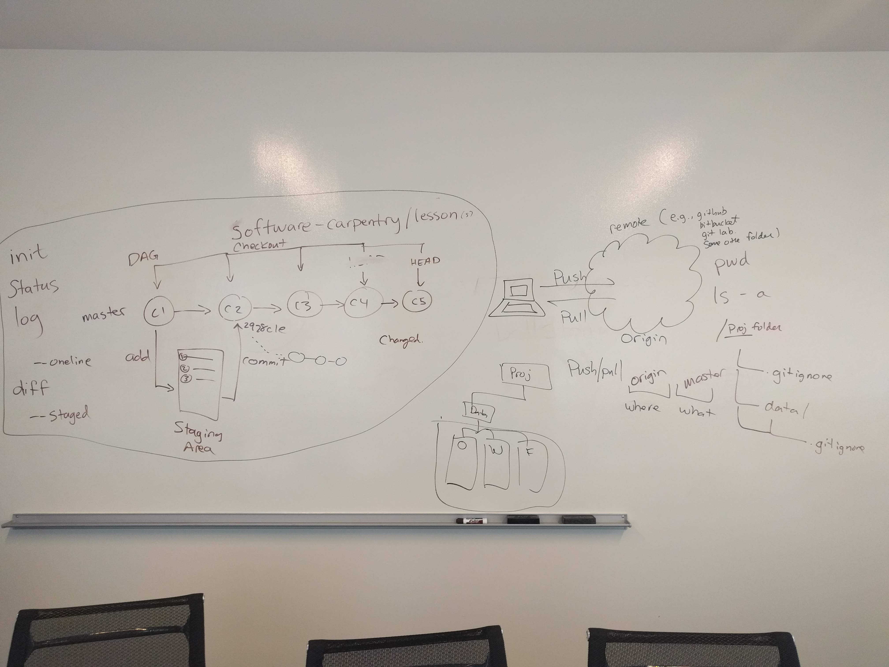

# Git

[Software-Carpentry Git Lesson][3]

DataCamp Courses:

- [Introduction to Git for Data Science][1]
- [Working with the RStudio IDE (Part 2) -- Chapter 2: Version Control][2]

Quick References:

1. [Software-Carpentry Reference][5]
2. [Git Cheat Sheet (by Github)][4]
3. [Jenny Bryan's "Happy Git and GitHub for the useR"][6]
4. [Git interaction from NDP Software][7]
5. [Learn Git Branching][8]

## Git on your own

(\#fig:unnamed-chunk-1)Diagram of Git commands and how they relate to one another.

## Git with branches

(\#fig:unnamed-chunk-2)Review of Git

(\#fig:unnamed-chunk-3)What branching looks like in the Git world

## Collaborating with Git

(\#fig:unnamed-chunk-4)The 'forking' model of Git workflows

(\#fig:unnamed-chunk-5)Git with branches

How not to write commit messages:

<blockquote class="twitter-tweet" data-lang="en">
how <a href="https://twitter.com/hashtag/not?src=hash&amp;ref_src=twsrc%5Etfw">#not</a> to write <a href="https://twitter.com/hashtag/git?src=hash&amp;ref_src=twsrc%5Etfw">#git</a> <a href="https://twitter.com/hashtag/commit?src=hash&amp;ref_src=twsrc%5Etfw">#commit</a> messages  -.-&#39;&#39; <a href="http://t.co/5TdiZ1yi5S">pic.twitter.com/5TdiZ1yi5S</a>
&mdash; Dⓐniel Chen (@chendaniely) <a href="https://twitter.com/chendaniely/status/588826374208618496?ref_src=twsrc%5Etfw">April 16, 2015</a></blockquote>

[1]: https://www.datacamp.com/courses/introduction-to-git-for-data-science
[2]: https://www.datacamp.com/courses/working-with-the-rstudio-ide-part-2
[3]: http://swcarpentry.github.io/git-novice/
[4]: https://services.github.com/on-demand/downloads/github-git-cheat-sheet.pdf
[5]: http://swcarpentry.github.io/git-novice/reference/
[6]: http://happygitwithr.com/
[7]: http://ndpsoftware.com/git-cheatsheet.html
[8]: https://learngitbranching.js.org/
